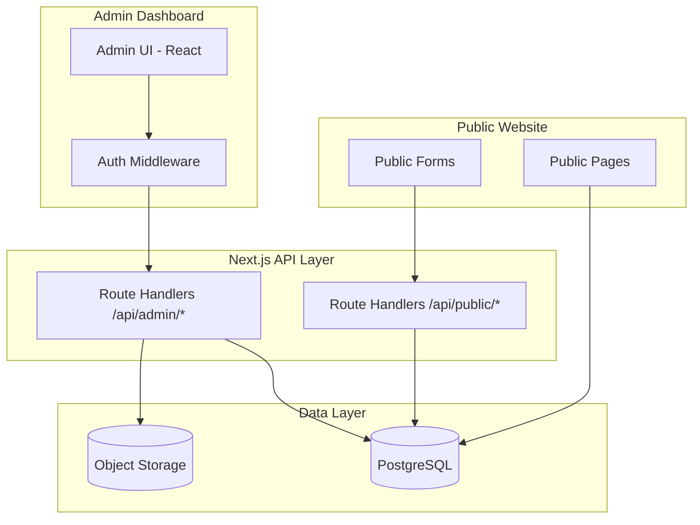
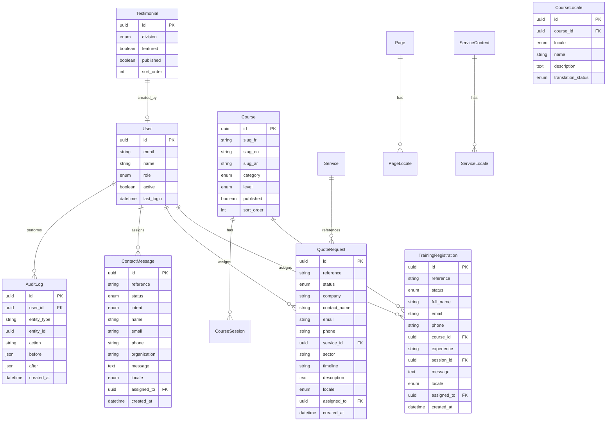
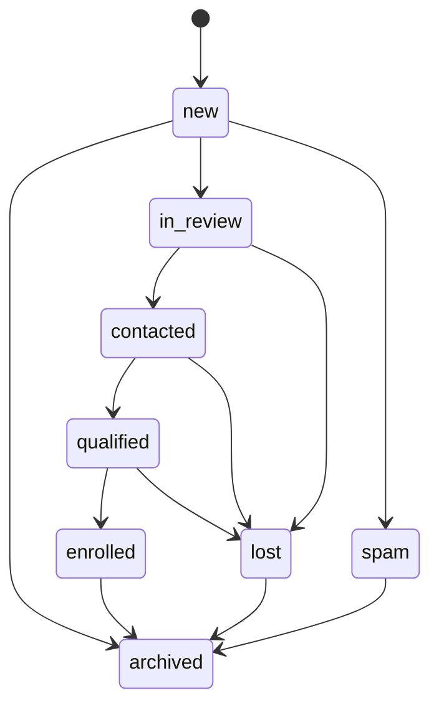
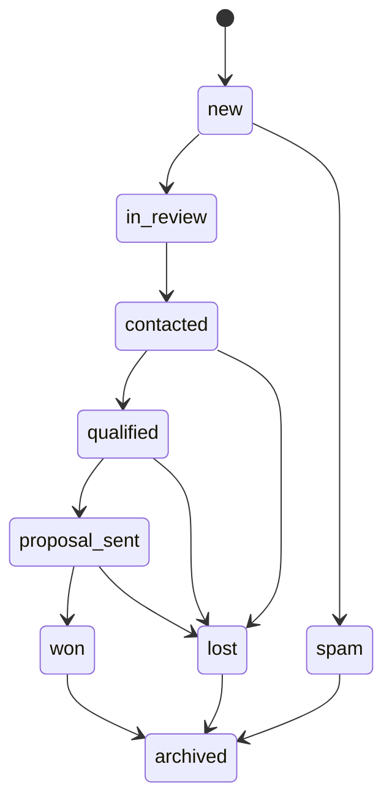

# SYNET Admin Dashboard — Architecture & UI Specification

> **Document type:** Architecture & UI reference  
> **Version:** 1.0  
> **Last updated:** 2026-06-08  
> **Companion docs:** [SYNET-UX-IA-REPORT.md](./SYNET-UX-IA-REPORT.md), [SYNET-DESIGN-SYSTEM.md](./SYNET-DESIGN-SYSTEM.md), [SYNET-BUSINESS-SOLUTIONS.md](./SYNET-BUSINESS-SOLUTIONS.md), [SYNET-TRAINING-CENTER.md](./SYNET-TRAINING-CENTER.md)  
> **Status:** Approved for planning — no implementation code yet  

This document defines the complete SYNET admin dashboard: system architecture, data models, role-based access, module behavior, shared UI patterns, and screen-level specifications. Consult it before building backend APIs, database schemas, or admin UI.

---

## Table of contents

1. [Purpose & scope](#1-purpose--scope)
2. [Design principles](#2-design-principles)
3. [Information architecture](#3-information-architecture)
4. [Technical architecture](#4-technical-architecture)
5. [Authentication & roles](#5-authentication--roles)
6. [Shared dashboard patterns](#6-shared-dashboard-patterns)
7. [Dashboard home](#7-dashboard-home)
8. [Module 1 — Training Registrations](#8-module-1--training-registrations)
9. [Module 2 — Quote Requests](#9-module-2--quote-requests)
10. [Module 3 — Contact Messages](#10-module-3--contact-messages)
11. [Module 4 — Course Management](#11-module-4--course-management)
12. [Module 5 — Testimonials](#12-module-5--testimonials)
13. [Module 6 — Website Content](#13-module-6--website-content)
14. [Module 7 — User Management](#14-module-7--user-management)
15. [Export to Excel](#15-export-to-excel)
16. [Notifications & audit log](#16-notifications--audit-log)
17. [Security & compliance](#17-security--compliance)
18. [Implementation phases](#18-implementation-phases)
19. [Screen inventory](#19-screen-inventory)

---

## 1. Purpose & scope

### Mission

Provide SYNET staff with a single, trustworthy internal console to:

- **Capture and process leads** from public forms (training enrollment, quote requests, contact)
- **Manage published website content** (courses, testimonials, pages, services metadata)
- **Govern users** with role-appropriate access
- **Measure conversion** via statistics and exportable reports

### In scope (v1)

| Area | Included |
|------|----------|
| **7 modules** | Training Registrations, Quote Requests, Contact Messages, Course Management, Testimonials, Website Content, User Management |
| **3 roles** | Super Admin, Admin, Trainer |
| **Cross-cutting** | Statistics, filters, search, Excel export, status tracking |
| **Locales** | Content editing per `fr`, `en`, `ar`; admin UI in **French** (default) with optional EN for staff |

### Out of scope (v1)

- Public-facing pages (already specified elsewhere)
- Payment processing / invoicing
- Full CRM pipeline (deals, forecasting) — status tracking only
- Mobile-native admin app (responsive web only)
- Machine translation of content

### Alignment with public site

Public forms today submit client-side mocks. The dashboard spec assumes these payloads persist to a database via API routes:

| Public form | Admin module |
|-------------|--------------|
| `EnrollmentForm` | Training Registrations |
| `QuoteRequestForm` | Quote Requests |
| Future `/contact` form | Contact Messages |
| Static `courses/*.ts` | Course Management (CMS replaces files over time) |
| Dictionary `testimonials` | Testimonials |
| Services, pages, globals | Website Content |

---

## 2. Design principles

### Admin vs. marketing site

The admin extends the SYNET design system with **data-dense enterprise patterns** (Cisco/Dell admin consoles), not a separate visual identity.

| Principle | Admin expression |
|-----------|------------------|
| **Trust & professionalism** | Navy sidebar, white content canvas, no decorative gradients |
| **Clarity over density** | Tables with clear hierarchy; detail panels for long text |
| **Consistent actions** | Primary = blue filled; destructive = error outline; status = semantic badges |
| **Efficiency** | Keyboard-friendly tables, bulk actions, saved filter presets |
| **Auditability** | Every status change and assignment logged with user + timestamp |

### Admin design tokens (extensions)

Reuse tokens from [SYNET-DESIGN-SYSTEM.md](./SYNET-DESIGN-SYSTEM.md). Add admin-specific tokens:

| Token | Value | Usage |
|-------|-------|-------|
| `admin-sidebar-width` | `260px` | Collapsed: `72px` (icons only) |
| `admin-topbar-height` | `56px` | Global search, user menu |
| `admin-content-max` | `1440px` | Main content area |
| `admin-table-row-height` | `48px` | Standard data row |
| `admin-radius` | `4px` | Same as marketing — no pill UI |

### Typography

- **UI:** Source Sans 3 (already loaded)
- **Data tables:** 14px body, 12px meta/captions
- **Page titles:** 24px semibold `navy-800`
- **Section titles:** 18px semibold `neutral-900`

### Iconography

Lucide React — outline style, 20px in nav, 16px inline in tables.

---

## 3. Information architecture

### URL structure

Admin lives **outside** public locale prefixes. Single admin locale for UI strings; content modules edit per-locale website data.

```
/admin/
├── login
├── forgot-password
├── reset-password
├── (authenticated)/
│   ├── dashboard                          [Home — statistics]
│   ├── registrations/                     [Module 1]
│   │   ├── [id]
│   │   └── export
│   ├── quotes/                            [Module 2]
│   │   ├── [id]
│   │   └── export
│   ├── messages/                          [Module 3]
│   │   ├── [id]
│   │   └── export
│   ├── courses/                           [Module 4]
│   │   ├── new
│   │   ├── [id]
│   │   └── [id]/sessions
│   ├── testimonials/                      [Module 5]
│   │   ├── new
│   │   └── [id]
│   ├── content/                           [Module 6]
│   │   ├── pages/
│   │   ├── services/
│   │   ├── globals/
│   │   └── media/
│   ├── users/                             [Module 7]
│   │   ├── new
│   │   └── [id]
│   ├── settings/                          [Super Admin only]
│   │   ├── general
│   │   ├── notifications
│   │   └── audit-log
│   └── profile
```

### Navigation (sidebar)

Fixed left sidebar, navy-800 background, white text. Grouped sections:

```
SYNET Admin
─────────────
Tableau de bord

OPÉRATIONS
  Inscriptions formation
  Demandes de devis
  Messages contact

CONTENU
  Formations
  Témoignages
  Contenu site

ADMINISTRATION          [Super Admin + Admin only]
  Utilisateurs

Paramètres              [Super Admin only]
```

Trainer sees only:

```
Tableau de bord (limited)
Inscriptions formation (assigned courses)
Formations (read + session notes)
Profil
```

### Breadcrumbs

Every inner page: `Module › List › Record` — e.g. `Inscriptions › Liste › INS-2026-0042`

---

## 4. Technical architecture

### Recommended stack (aligned with existing project)

| Layer | Choice | Rationale |
|-------|--------|-----------|
| **Framework** | Next.js 16 App Router | Same repo as public site; shared types |
| **Language** | TypeScript | Matches `Course`, `Service` types |
| **Styling** | Tailwind CSS v4 | Shared tokens via `globals.css` |
| **Database** | PostgreSQL | Relational fit for leads, RBAC, audit |
| **ORM** | Prisma | Schema migrations, type-safe queries |
| **Auth** | NextAuth.js v5 (Auth.js) | Credentials + optional Microsoft SSO later |
| **Session** | HTTP-only JWT or database sessions | 8h idle timeout, 24h absolute |
| **File storage** | S3-compatible (or local dev) | Course images, media library |
| **Email** | Resend / SMTP | New lead notifications |
| **Excel export** | `exceljs` or `xlsx` | Server-side generation |
| **Validation** | Zod | Shared schemas public API ↔ admin |

### High-level architecture



### Folder structure (implementation target)

```
src/
├── app/
│   ├── admin/
│   │   ├── layout.tsx              # Admin shell (sidebar + topbar)
│   │   ├── login/page.tsx
│   │   └── (dashboard)/
│   │       ├── dashboard/page.tsx
│   │       ├── registrations/
│   │       ├── quotes/
│   │       ├── messages/
│   │       ├── courses/
│   │       ├── testimonials/
│   │       ├── content/
│   │       └── users/
│   └── api/
│       ├── admin/                  # Protected admin APIs
│       └── public/                 # Form submissions
├── components/
│   └── admin/                      # Admin-only components
├── lib/
│   ├── admin/
│   │   ├── auth.ts
│   │   ├── permissions.ts
│   │   ├── export.ts
│   │   └── types.ts
│   └── db/                         # Prisma client
└── middleware.ts                   # Extend: /admin/* auth guard
```

### Database entities (core)



### API design conventions

| Convention | Rule |
|------------|------|
| **Prefix** | `/api/admin/v1/...` |
| **Auth** | Bearer session cookie; role checked per route |
| **List** | `GET` with `?page=1&limit=25&sort=-created_at&status=new&q=...` |
| **Detail** | `GET /:id` |
| **Update** | `PATCH /:id` (partial — status, assignee, notes) |
| **Export** | `GET /export?format=xlsx&...filters` |
| **Errors** | `{ error: { code, message } }` — French messages in admin |

---

## 5. Authentication & roles

### Roles

| Role | Code | Description |
|------|------|-------------|
| **Super Admin** | `super_admin` | Full system access, settings, user CRUD, all modules |
| **Admin** | `admin` | All operational + content modules; no destructive system settings |
| **Trainer** | `trainer` | Training registrations (assigned), course read, limited dashboard |

### Permission matrix

| Capability | Super Admin | Admin | Trainer |
|------------|:-----------:|:-----:|:-------:|
| Dashboard — full stats | ✓ | ✓ | ◐ Limited |
| Training Registrations — view all | ✓ | ✓ | ◐ Assigned only |
| Training Registrations — update status | ✓ | ✓ | ✓ Assigned |
| Training Registrations — assign | ✓ | ✓ | — |
| Training Registrations — export | ✓ | ✓ | ◐ Assigned |
| Quote Requests — view | ✓ | ✓ | — |
| Quote Requests — update / assign | ✓ | ✓ | — |
| Quote Requests — export | ✓ | ✓ | — |
| Contact Messages — view | ✓ | ✓ | — |
| Contact Messages — update | ✓ | ✓ | — |
| Course Management — create/edit | ✓ | ✓ | — |
| Course Management — view | ✓ | ✓ | ✓ |
| Course Management — sessions | ✓ | ✓ | ◐ Notes only |
| Testimonials — CRUD | ✓ | ✓ | — |
| Website Content — pages/services | ✓ | ✓ | — |
| Website Content — publish | ✓ | ✓ | — |
| User Management — CRUD | ✓ | ◐ View only | — |
| Settings / Audit log | ✓ | — | — |
| Delete records (soft) | ✓ | ◐ Leads only | — |

◐ = partial / scoped access

### Login screen

```
┌────────────────────────────────────────────────────────────┐
│  [navy panel 40%]          │  [white panel 60%]            │
│                            │                               │
│  SYNET logo (white)        │  Connexion administrateur     │
│  Tagline                   │                               │
│  "Console interne SYNET"   │  Email ___________________    │
│                            │  Mot de passe _____________ 👁 │
│                            │  [ ] Se souvenir de moi       │
│                            │  [ Se connecter (primary) ]   │
│                            │  Mot de passe oublié ?        │
└────────────────────────────────────────────────────────────┘
```

- No public signup
- Account creation only via User Management (Super Admin)
- Failed login: generic error (no email enumeration)
- 5 failed attempts → 15 min lockout per IP + email

---

## 6. Shared dashboard patterns

### 6.1 Application shell

```
┌──────────┬──────────────────────────────────────────────────┐
│ SIDEBAR  │ TOPBAR: [Search...] [🔔] [Avatar ▾]              │
│ 260px    ├──────────────────────────────────────────────────┤
│          │ Page title                    [Primary] [Secondary]│
│ Nav      │ Subtitle / breadcrumb                            │
│ items    ├──────────────────────────────────────────────────┤
│          │ ┌─ Stats row (4 cards) ─────────────────────────┐ │
│          │ └───────────────────────────────────────────────┘ │
│          │ ┌─ Filter bar ─────────────────────────────────┐ │
│          │ │ Search | Status ▾ | Date range | More ▾      │ │
│          │ │                        [Réinitialiser] [Export]│ │
│          │ └───────────────────────────────────────────────┘ │
│          │ ┌─ Data table ─────────────────────────────────┐ │
│          │ │ □ | Ref | Name | ... | Status | Date | ⋮     │ │
│          │ └───────────────────────────────────────────────┘ │
│          │ Pagination: < 1 2 3 ... 12 >    25 par page ▾    │
└──────────┴──────────────────────────────────────────────────┘
```

### 6.2 Stat cards

Four-up grid on module list pages and dashboard home.

| Element | Spec |
|---------|------|
| **Container** | White card, 1px `neutral-200` border, 4px radius, 20px padding |
| **Label** | 12px uppercase `neutral-500`, letter-spacing 0.04em |
| **Value** | 28px semibold `navy-800` |
| **Delta** | Optional: `+12% vs mois dernier` — green/red 12px |
| **Icon** | Top-right, 20px, `blue-600` in `blue-100` circle |

Click stat card → applies related filter on table (e.g. "Nouveau" → status filter).

### 6.3 Status badges

Shared across lead modules:

| Status | Label (FR) | Color |
|--------|------------|-------|
| `new` | Nouveau | `info-100` / `info-600` |
| `in_review` | En cours | `warning-100` / `warning-600` |
| `contacted` | Contacté | `blue-100` / `blue-700` |
| `qualified` | Qualifié | `success-100` / `success-600` |
| `enrolled` / `won` | Inscrit / Gagné | `success-100` / `success-600` |
| `lost` | Perdu | `neutral-100` / `neutral-500` |
| `spam` | Spam | `error-100` / `error-600` |
| `archived` | Archivé | `neutral-100` / `neutral-500` |

Content publishing statuses (Course, Testimonial, Page):

| Status | Label (FR) | Color |
|--------|------------|-------|
| `draft` | Brouillon | `neutral-100` / `neutral-700` |
| `review` | En révision | `warning-100` / `warning-600` |
| `published` | Publié | `success-100` / `success-600` |

### 6.4 Data table

| Feature | Behavior |
|---------|----------|
| **Columns** | Sortable headers (click toggles asc/desc) |
| **Row click** | Opens detail drawer (leads) or navigates to edit (content) |
| **Selection** | Checkbox column; bulk status update + bulk assign |
| **Empty state** | Illustration-free: icon + "Aucun enregistrement" + clear filters CTA |
| **Loading** | Skeleton rows (5), no spinner overlay |
| **Row actions** | `⋮` menu: Voir, Changer statut, Assigner, Exporter, Archiver |

### 6.5 Filter bar

| Control | Type | Notes |
|---------|------|-------|
| **Search** | Text input, debounced 300ms | Searches reference, name, email, company |
| **Status** | Multi-select dropdown | Chip display when active |
| **Date range** | Presets: Aujourd'hui, 7j, 30j, Ce mois, Personnalisé | Default: 30j |
| **Assignee** | User dropdown | "Non assigné" option |
| **Locale** | FR / EN / AR | Source language of submission |
| **Saved filters** | Super Admin / Admin can save named presets | Stored per user |

Filter state syncs to URL query params for shareable links.

### 6.6 Detail drawer (lead modules)

Right-side panel, 480px width, overlay backdrop.

```
┌─ INS-2026-0042 ─────────────── [×] ─┐
│ Status: [Nouveau ▾]  Assigné: [▾]   │
├─────────────────────────────────────┤
│ Contact                             │
│ Nom, email, téléphone (copy icons)  │
│ Formation, session, expérience      │
│ Message                             │
├─────────────────────────────────────┤
│ Notes internes                      │
│ [Textarea — append-only thread]     │
│ [Ajouter une note]                  │
├─────────────────────────────────────┤
│ Historique                          │
│ • 08/06 14:32 — Statut → En cours   │
│ • 08/06 10:15 — Créé (formulaire)   │
├─────────────────────────────────────┤
│ [Exporter]  [Archiver]  [Email ↗]   │
└─────────────────────────────────────┘
```

### 6.7 Forms (content modules)

- Two-column layout on desktop: main fields left (70%), sidebar right (30%) for status, publish, locale tabs
- Locale tabs: `FR | EN | AR` with completion indicator (● complete, ○ incomplete)
- Sticky footer: `Annuler` | `Enregistrer brouillon` | `Publier`
- Unsaved changes warning on navigate away

---

## 7. Dashboard home

### Purpose

At-a-glance operational health for leadership and admins.

### Layout

**Row 1 — KPI cards (6)**

| Card | Metric | Source |
|------|--------|--------|
| Nouvelles inscriptions | Count last 7d | Training Registrations `status=new` |
| Nouvelles demandes devis | Count last 7d | Quote Requests `status=new` |
| Messages non lus | Count | Contact Messages `status=new` |
| Taux de conversion inscriptions | `enrolled / total` 30d | Registrations |
| Taux de conversion devis | `won / total` 30d | Quotes |
| Formations actives | Published courses | Course Management |

**Row 2 — Charts (2 columns)**

| Chart | Type | Data |
|-------|------|------|
| Activité des leads | Stacked bar, 12 weeks | Registrations + Quotes + Messages by week |
| Répartition par statut | Donut | All open leads by status |

**Row 3 — Tables (2 columns)**

| Widget | Content |
|--------|---------|
| Dernières inscriptions | 5 rows, link to module |
| Demandes devis urgentes | 5 rows where `timeline=urgent` or `status=new` > 48h |

**Row 4 — Quick actions**

Buttons: `Voir inscriptions`, `Voir devis`, `Ajouter formation`, `Publier contenu`

### Trainer dashboard variant

- KPI: Mes inscriptions assignées, En cours, Inscrits ce mois
- Table: Assigned registrations only
- No quote/message widgets

---

## 8. Module 1 — Training Registrations

### Purpose

Manage enrollment form submissions from `/inscription-formation` (all locales).

### Data model (maps from public `EnrollmentForm`)

| Field | Type | Required | Notes |
|-------|------|----------|-------|
| `reference` | string | auto | `INS-YYYY-NNNN` |
| `full_name` | string | ✓ | |
| `email` | string | ✓ | |
| `phone` | string | ✓ | |
| `course_id` | FK | ✓ | Links to Course |
| `experience` | enum | ✓ | `none`, `beginner`, `intermediate`, `advanced` |
| `session_id` | FK | optional | Selected session |
| `message` | text | optional | |
| `locale` | enum | ✓ | `fr`, `en`, `ar` |
| `status` | enum | ✓ | See workflow |
| `assigned_to` | FK User | optional | |
| `source_url` | string | optional | Referrer page |
| `ip_hash` | string | optional | Privacy-safe duplicate detection |

### Status workflow



### List view columns

| Column | Sortable | Notes |
|--------|----------|-------|
| Réf. | ✓ | `INS-2026-0042` |
| Nom | ✓ | |
| Formation | ✓ | Course name (locale of submission) |
| Session | — | Date range or "—" |
| Expérience | — | Badge |
| Statut | ✓ | Status badge |
| Assigné | ✓ | Avatar + name or "—" |
| Date | ✓ | `created_at` relative + tooltip absolute |
| Actions | — | Row menu |

### Filters

| Filter | Options |
|--------|---------|
| Statut | All workflow states |
| Formation | Course dropdown |
| Session | Dependent on course |
| Expérience | 4 levels |
| Assigné | Users with trainer/admin role |
| Locale | fr, en, ar |
| Période | Date range |

### Statistics (module header)

| Stat | Description |
|------|-------------|
| Total (période) | Filtered count |
| Nouveau | `status=new` |
| En cours | `in_review` + `contacted` |
| Inscrits | `status=enrolled` |
| Taux conversion | `enrolled / (total - spam - archived)` |

### Detail view extras

- **Email shortcut:** `mailto:` with prefilled template (admissions)
- **Duplicate detection:** Banner if same email + course within 30 days
- **Linked course:** Quick link to Course Management edit

---

## 9. Module 2 — Quote Requests

### Purpose

Manage B2B quote form submissions from `/demande-devis` (all locales).

### Data model (maps from public `QuoteRequestForm`)

| Field | Type | Required |
|-------|------|----------|
| `reference` | string | auto `DEV-YYYY-NNNN` |
| `company` | string | ✓ |
| `contact_name` | string | ✓ |
| `email` | string | ✓ |
| `phone` | string | ✓ |
| `service_id` | FK | ✓ |
| `sector` | enum | ✓ | `sme`, `school`, `clinic`, `factory`, `government`, `other` |
| `timeline` | enum | ✓ | `urgent`, `1-3months`, `3-6months`, `exploring` |
| `description` | text | ✓ |
| `locale` | enum | ✓ |
| `status` | enum | ✓ |
| `assigned_to` | FK | optional |
| `estimated_value` | decimal | optional | Admin-only field |
| `notes` | thread | optional | Internal |

### Status workflow



### List view columns

| Column | Notes |
|--------|-------|
| Réf. | `DEV-2026-0018` |
| Entreprise | |
| Contact | Name + email subline |
| Service | Service name |
| Secteur | Badge |
| Délai | Urgent = `warning` badge |
| Statut | |
| Valeur est. | Optional column, Admin+ |
| Assigné | |
| Date | |

### Filters

Statut, Service, Secteur, Délai, Assigné, Locale, Période, Valeur est. (range)

### Statistics

| Stat | Description |
|------|-------------|
| Nouveau | Unassigned + new |
| Urgent | `timeline=urgent` AND open |
| En proposition | `proposal_sent` |
| Gagné (MRR/period) | Count + sum `estimated_value` |
| Taux qualification | `qualified / (total - spam)` |

### Detail view extras

- **Company card:** sector, timeline, service with link to public service page
- **Proposal tracking:** date sent, follow-up reminder (manual flag)
- **Print/PDF:** Single-page summary for sales meetings (future)

---

## 10. Module 3 — Contact Messages

### Purpose

Unified inbox for general contact form submissions (future `/contact` page) and overflow inquiries.

### Data model

| Field | Type | Required |
|-------|------|----------|
| `reference` | string | auto `MSG-YYYY-NNNN` |
| `intent` | enum | ✓ | `business`, `training`, `both`, `other` |
| `name` | string | ✓ |
| `email` | string | ✓ |
| `phone` | string | optional |
| `organization` | string | optional |
| `subject` | string | optional |
| `message` | text | ✓ |
| `locale` | enum | ✓ |
| `status` | enum | ✓ |
| `assigned_to` | FK | optional |
| `routed_to` | enum | auto | Derived from intent: sales, admissions, general |

### Status workflow

```
new → in_review → replied → resolved → archived
                 ↘ spam → archived
```

### List view

Inbox-style: unread bold row when `status=new`. Intent badge colors:

| Intent | Color |
|--------|-------|
| business | navy |
| training | blue |
| both | split badge |
| other | neutral |

### Filters

Intent, Statut, Routage, Assigné, Locale, Période, Non lu seulement

### Statistics

| Stat | Description |
|------|-------------|
| Non lus | `new` |
| Temps réponse moyen | `replied_at - created_at` avg |
| Par intention | Count breakdown |
| En attente > 48h | SLA breach count |

### Routing rules (automatic on create)

| Intent | Default assignee pool | Notification |
|--------|----------------------|--------------|
| business | Sales admins | Email sales@ |
| training | Admissions admins | Email formation@ |
| both | Both pools | Dual notification |
| other | General inbox | contact@ |

---

## 11. Module 4 — Course Management

### Purpose

CRUD for training programs currently defined in `src/lib/training/courses/{fr,en,ar}.ts`. Replaces static files with database-backed content editable per locale.

### Data model

**Course (master)**

| Field | Type | Notes |
|-------|------|-------|
| `id` | uuid | |
| `slug_fr`, `slug_en`, `slug_ar` | string | Unique per locale |
| `category` | enum | Matches `CourseCategory` |
| `level` | enum | Matches `CourseLevel` |
| `image_variant` | enum | Visual placeholder key |
| `featured` | boolean | Homepage featured courses |
| `published` | boolean | Master switch |
| `sort_order` | int | Catalog order |

**CourseLocale** (per `fr`, `en`, `ar`)

| Field | Type |
|-------|------|
| `name`, `short_description`, `description` | text |
| `duration`, `schedule`, `price`, `price_note` | string |
| `certification` | string optional |
| `outcomes[]`, `prerequisites[]` | JSON arrays |
| `instructor_name`, `instructor_title`, `instructor_bio` | text |
| `translation_status` | draft / review / published |
| `meta_title`, `meta_description` | SEO |

**CourseSession**

| Field | Type |
|-------|------|
| `start_date`, `end_date` | date |
| `format` | string (Présentiel, En ligne, Hybride) |
| `spots_total`, `spots_left` | int |
| `published` | boolean |

### List view

| Column | Notes |
|--------|-------|
| Formation | Name (FR default column) |
| Catégorie | Badge |
| Niveau | Badge |
| Sessions | Upcoming count |
| Locales | `FR ● EN ● AR ○` completion dots |
| Statut | Published/Draft |
| Inscriptions | Link count → filtered registrations |
| Actions | Edit, Duplicate, Preview |

### Filters

Catégorie, Niveau, Publié, Vedette, Locale complétude, Recherche (name/slug)

### Statistics

| Stat | Description |
|------|-------------|
| Formations publiées | |
| Brouillons | |
| Sessions à venir | Next 90 days |
| Inscriptions actives | Open registrations per course |

### Edit screen (tabbed)

```
[Général] [Contenu FR] [Contenu EN] [Contenu AR] [Sessions] [SEO] [Aperçu]
```

**Général:** category, level, slugs (with uniqueness validation), image, featured toggle

**Sessions sub-page:** Table of sessions + add/edit modal

**Preview:** Opens public course URL in new tab (draft preview token for unpublished)

### Trainer permissions

- View all courses
- Edit `instructor_bio` on assigned courses only (optional v1.1)
- Add session attendance notes on assigned registrations

---

## 12. Module 5 — Testimonials

### Purpose

Manage homepage and division testimonials currently in locale dictionaries.

### Data model

| Field | Type | Notes |
|-------|------|-------|
| `division` | enum | `business`, `training` |
| `featured` | boolean | Homepage carousel eligibility |
| `published` | boolean | |
| `sort_order` | int | |
| **Per locale** | | |
| `quote` | text | Testimonial body |
| `attribution` | string | Name or anonymized label |
| `role` | string | Job title / context |
| `organization` | string | optional |
| `locale` | enum | |

### List view

| Column | Notes |
|--------|-------|
| Citation | Truncated 80 chars |
| Division | Badge |
| Auteur | |
| Vedette | ★ icon |
| Locales | Completion |
| Statut | |
| Actions | |

### Filters

Division, Vedette, Publié, Locale, Recherche

### Edit form

- Quote textarea with character count (recommended 200–400 chars)
- Division selector
- Featured toggle (max 6 featured — validation warning)
- Locale tabs for quote, attribution, role
- Preview card (matches public `TestimonialsSection` styling)

### Statistics

| Stat | Description |
|------|-------------|
| Publiés | |
| Vedette | |
| Par division | business vs training balance |

---

## 13. Module 6 — Website Content

### Purpose

Central CMS for non-course content: static pages, service copy, global settings, media. Aligns with [UX IA content model](./SYNET-UX-IA-REPORT.md#content-model-cms-ready).

### Sub-modules

#### 13.1 Pages

| Page type | Examples |
|-----------|----------|
| Core | About, Contact, Legal (×3) |
| Hub intros | Business Solutions hub, Training Center hub |
| Sector | Future sector pages |
| Case study | Future case studies |

**Editor:** Block-based (v1 simplified)

| Block type | Fields |
|------------|--------|
| Hero | overline, heading, lead, CTA |
| Rich text | markdown body |
| CTA band | heading, buttons |
| Stats | items[] |
| FAQ | items[] |

#### 13.2 Services

Edit service content mirroring `Service` type: benefits, process steps, technologies — per locale. Slug immutable after publish (redirect if changed).

List: 7 services with locale completion matrix.

#### 13.3 Globals

| Setting | Locales |
|---------|---------|
| Contact info (phone, email, address) | ✓ |
| Footer tagline | ✓ |
| Homepage section copy (hero, overviews) | ✓ |
| Nav labels | ✓ (override dictionary) |
| Social links | — |
| Office hours | ✓ |

#### 13.4 Media library

| Feature | Spec |
|---------|------|
| Upload | JPG, PNG, WebP, PDF; max 5MB image |
| Folders | `/courses`, `/services`, `/team`, `/general` |
| Fields | alt text (required per locale), caption |
| Usage | Show where image is referenced |

### List pattern (Pages & Services)

Same table/filter pattern as other modules. Additional filters: Type, Division, Translation status, Published.

### Statistics

| Stat | Description |
|------|-------------|
| Pages publiées | Per locale |
| Contenu incomplet | Missing required locale fields |
| Dernière modification | Recent activity feed |

### Publish workflow

```
draft → review → published
         ↑
    Admin requests review
         ↓
    Super Admin can force-publish (logged)
```

---

## 14. Module 7 — User Management

### Purpose

Internal account administration. Super Admin only for create/delete; Admin can view.

### Data model

| Field | Type | Notes |
|-------|------|-------|
| `email` | string | Unique, login ID |
| `name` | string | Display name |
| `role` | enum | `super_admin`, `admin`, `trainer` |
| `active` | boolean | Deactivate without delete |
| `phone` | string | optional |
| `assigned_divisions` | enum[] | `business`, `training` — for routing |
| `notification_prefs` | JSON | Email on new lead, etc. |
| `last_login` | datetime | |
| `created_by` | FK | |

### List view

| Column | Notes |
|--------|-------|
| Nom | |
| Email | |
| Rôle | Badge (Super Admin = navy) |
| Statut | Actif / Inactif |
| Dernière connexion | |
| Actions | Edit, Désactiver, Réinitialiser MDP |

### Create / Edit form

- Email, name, role, divisions
- Temporary password auto-generated → force change on first login
- Cannot demote last Super Admin (validation)
- Trainer: optional "Assigned courses" multi-select

### Statistics

| Stat | Description |
|------|-------------|
| Utilisateurs actifs | |
| Par rôle | Breakdown |
| Connexions 7j | Active users |

---

## 15. Export to Excel

### Global rules

| Rule | Spec |
|------|------|
| **Format** | `.xlsx` (Excel 2007+) |
| **Trigger** | Module list "Exporter" button; bulk export from selection |
| **Scope** | Current filters applied unless "Tout exporter" confirmed |
| **Limit** | Max 10,000 rows per export; warn above 1,000 |
| **Filename** | `synet-{module}-{YYYY-MM-DD}.xlsx` |
| **Sheet name** | Module name in French |
| **Header row** | Navy background `#0B1F3A`, white text, bold, frozen |
| **Auth** | Role must have export permission |
| **Audit** | Log every export: user, filters, row count |

### Column sets per module

**Training Registrations**

`Référence, Date, Nom, Email, Téléphone, Formation, Session, Expérience, Message, Statut, Assigné, Locale, URL source, Notes (concatenated)`

**Quote Requests**

`Référence, Date, Entreprise, Contact, Email, Téléphone, Service, Secteur, Délai, Description, Statut, Valeur estimée, Assigné, Locale, Notes`

**Contact Messages**

`Référence, Date, Intention, Nom, Email, Téléphone, Organisation, Sujet, Message, Statut, Routage, Assigné, Locale, Date réponse`

**Courses**

`ID, Nom FR, Catégorie, Niveau, Publié, Vedette, Sessions à venir, Inscriptions (30j), FR, EN, AR statut`

**Testimonials**

`ID, Division, Citation FR, Auteur, Rôle, Vedette, Publié, FR/EN/AR`

**Users**

`Nom, Email, Rôle, Divisions, Actif, Dernière connexion` — Super Admin only; no passwords

### Export UI

```
[Exporter ▾]
  ├── Exporter la sélection (12)
  ├── Exporter avec filtres actuels (~248)
  └── Tout exporter (confirm dialog)
```

Progress toast → download link (signed URL, 15 min expiry).

---

## 16. Notifications & audit log

### In-app notifications (bell icon)

| Event | Recipients |
|-------|------------|
| New registration | Admissions pool |
| New quote (urgent) | Sales pool + sound badge |
| New contact message | Routed pool |
| Assignment to me | Assigned user |
| Content submitted for review | Super Admin |
| Export completed | Requesting user |

Notification drawer: last 50, mark read, link to record.

### Email notifications (configurable in Settings)

- Instant email for `new` leads (toggle per user)
- Daily digest at 08:00 Africa/Casablanca (Admin+)

### Audit log (Super Admin)

| Field | Example |
|-------|---------|
| `user` | Fatima Z. |
| `action` | `status_change` |
| `entity` | `QuoteRequest:DEV-2026-0018` |
| `before` | `{ "status": "new" }` |
| `after` | `{ "status": "in_review" }` |
| `ip` | — |
| `timestamp` | ISO 8601 |

Retention: 24 months. Immutable.

---

## 17. Security & compliance

| Requirement | Implementation |
|-------------|----------------|
| **HTTPS only** | Enforced in production |
| **CSRF** | Same-site cookies + token on mutations |
| **RBAC** | Server-side check every API route |
| **PII** | Encrypt phone at rest (optional v1.1); mask in exports for Trainer |
| **GDPR / consent** | Store form consent timestamp; deletion request workflow |
| **Rate limiting** | Public forms: 5/min per IP; Admin login: 5 attempts |
| **Session** | Secure, HttpOnly, SameSite=Lax |
| **CORS** | Admin API same-origin only |
| **CSP** | Stricter than public site |
| **Backups** | Daily DB backup, 30-day retention |

---

## 18. Implementation phases

### Phase A — Foundation (2–3 weeks)

- [ ] PostgreSQL + Prisma schema (users, audit)
- [ ] Auth (login, session, middleware guard)
- [ ] Admin shell (sidebar, topbar, breadcrumbs)
- [ ] Shared components: DataTable, FilterBar, StatCard, StatusBadge, DetailDrawer
- [ ] Dashboard home (static mock stats)

### Phase B — Lead modules (2–3 weeks)

- [ ] Public API: persist enrollment, quote, contact submissions
- [ ] Training Registrations CRUD + status + notes
- [ ] Quote Requests CRUD + status + notes
- [ ] Contact Messages inbox
- [ ] Email notifications on new leads
- [ ] Excel export (3 lead modules)

### Phase C — Content modules (3–4 weeks)

- [ ] Course Management + sessions + locale tabs
- [ ] Migrate static courses to DB seed
- [ ] Testimonials CRUD
- [ ] Website Content: services editor, globals
- [ ] Media library
- [ ] Public site reads from DB (feature flag)

### Phase D — Administration & polish (1–2 weeks)

- [ ] User Management
- [ ] Audit log viewer
- [ ] Saved filters, bulk actions
- [ ] Dashboard charts (real data)
- [ ] QA: RBAC matrix, accessibility, responsive

---

## 19. Screen inventory

| # | Screen | Route | Roles |
|---|--------|-------|-------|
| 1 | Login | `/admin/login` | Public |
| 2 | Dashboard home | `/admin/dashboard` | All |
| 3 | Registrations list | `/admin/registrations` | All* |
| 4 | Registration detail | drawer | All* |
| 5 | Quotes list | `/admin/quotes` | SA, Admin |
| 6 | Quote detail | drawer | SA, Admin |
| 7 | Messages list | `/admin/messages` | SA, Admin |
| 8 | Message detail | drawer | SA, Admin |
| 9 | Courses list | `/admin/courses` | All* |
| 10 | Course create/edit | `/admin/courses/[id]` | SA, Admin |
| 11 | Course sessions | `/admin/courses/[id]/sessions` | SA, Admin |
| 12 | Testimonials list | `/admin/testimonials` | SA, Admin |
| 13 | Testimonial edit | `/admin/testimonials/[id]` | SA, Admin |
| 14 | Pages list | `/admin/content/pages` | SA, Admin |
| 15 | Page editor | `/admin/content/pages/[id]` | SA, Admin |
| 16 | Services list | `/admin/content/services` | SA, Admin |
| 17 | Service editor | `/admin/content/services/[id]` | SA, Admin |
| 18 | Globals | `/admin/content/globals` | SA, Admin |
| 19 | Media library | `/admin/content/media` | SA, Admin |
| 20 | Users list | `/admin/users` | SA, Admin† |
| 21 | User create/edit | `/admin/users/[id]` | SA |
| 22 | Settings | `/admin/settings` | SA |
| 23 | Audit log | `/admin/settings/audit-log` | SA |
| 24 | Profile | `/admin/profile` | All |

\*Trainer has scoped access — see [Permission matrix](#permission-matrix).  
†Admin view-only.

**Total: 24 screens** (+ shared drawers/modals)

---

## Document changelog

| Version | Date | Changes |
|---------|------|---------|
| 1.0 | 2026-06-08 | Initial architecture & UI specification |

---

*End of document — use this file as the single source of truth for SYNET admin dashboard decisions.*
