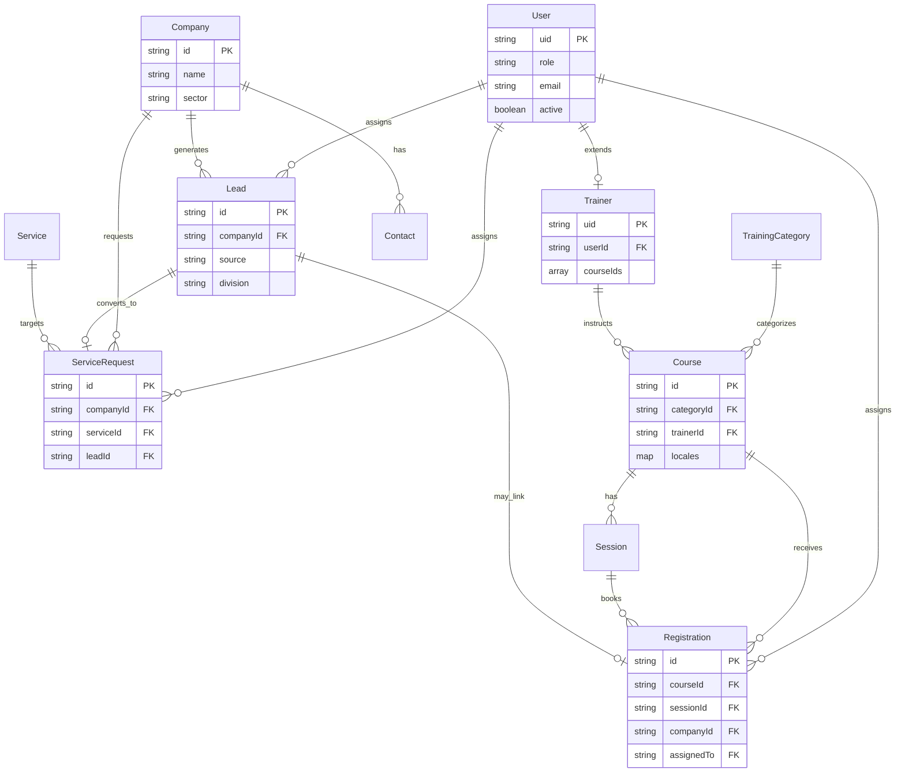
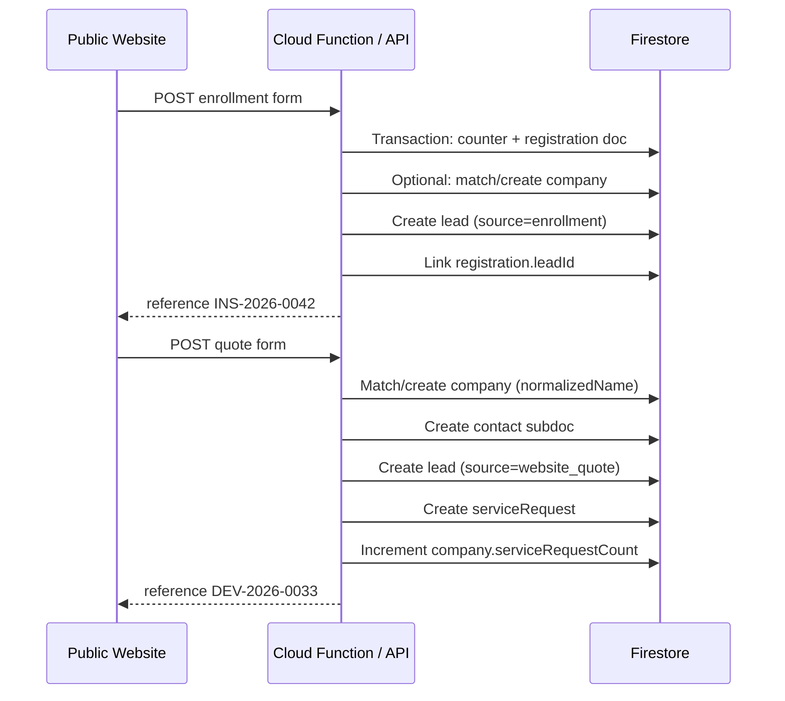

# SYNET Firebase Firestore — Database Structure

> **Document type:** Database architecture reference  
> **Version:** 1.0  
> **Last updated:** 2026-06-08  
> **Companion docs:** [SYNET-ADMIN-DASHBOARD.md](./SYNET-ADMIN-DASHBOARD.md), [SYNET-UX-IA-REPORT.md](./SYNET-UX-IA-REPORT.md)  
> **Status:** Approved for planning — no implementation code yet  

This document defines the complete Firestore schema for SYNET: collections, document shapes, relationships, composite indexes, security rules strategy, and long-term scalability patterns. It replaces the PostgreSQL model in the admin dashboard spec when Firebase is the chosen backend.

---

## Table of contents

1. [Design principles](#1-design-principles)
2. [Collection map](#2-collection-map)
3. [Entity relationship diagram](#3-entity-relationship-diagram)
4. [Users & access](#4-users--access)
5. [Training domain](#5-training-domain)
6. [Business domain](#6-business-domain)
7. [Website domain](#7-website-domain)
8. [Supporting collections](#8-supporting-collections)
9. [Relationships reference](#9-relationships-reference)
10. [Composite indexes](#10-composite-indexes)
11. [Security rules](#11-security-rules)
12. [Scalability & operations](#12-scalability--operations)
13. [Migration & seeding](#13-migration--seeding)
14. [TypeScript interfaces](#14-typescript-interfaces)

---

## 1. Design principles

### Firestore-first patterns

| Principle | SYNET application |
|-----------|-------------------|
| **Flat top-level collections** | Admin lists query across all registrations, leads, requests — avoid nesting under parents |
| **Subcollections for bounded children** | Course sessions, internal notes, activity logs — tied lifecycle, unbounded append |
| **Denormalize for reads** | Store `courseName`, `companyName`, `assigneeName` on lead docs — public site and admin tables avoid N+1 |
| **Reference by ID string** | `courseId`, `companyId`, `trainerId` — not DocumentReference in client payloads (server resolves) |
| **Locale as map, not subcollection** | `locales.fr`, `locales.en`, `locales.ar` on content docs — single read for public pages |
| **Immutable audit trail** | Activity in subcollections; parent doc holds current state only |
| **Server-authoritative writes** | Public forms write via Cloud Functions or Next.js API — never trust client for status/role |
| **Soft delete** | `deletedAt` timestamp — no hard delete on leads or content with audit requirements |

### ID strategy

| Entity | Document ID | Human reference |
|--------|-------------|-----------------|
| Users | Firebase Auth `uid` | — |
| Trainers | Same as `uid` (1:1 with user) | — |
| Courses | Auto ID `course_abc123` | — |
| Registrations | Auto ID | `reference`: `INS-2026-0042` |
| Companies | Auto ID | `reference`: `ENT-2026-0018` |
| Leads | Auto ID | `reference`: `LED-2026-0091` |
| Service requests | Auto ID | `reference`: `DEV-2026-0033` |
| Content | Auto ID or semantic slug key | `slug` per locale on doc |

Reference numbers generated via **transaction on `counters/{year}_{type}`** (see [§12](#12-scalability--operations)).

### Timestamp fields (all operational docs)

```typescript
createdAt: Timestamp   // server timestamp on create
updatedAt: Timestamp   // server timestamp on every write
createdBy?: string     // uid — admin-created records only
updatedBy?: string     // uid — last editor
deletedAt?: Timestamp  // soft delete
```

---

## 2. Collection map

```
firestore/
│
├── users/                          # Auth profiles (Admin, Trainer)
├── trainers/                       # Trainer extended profiles
│
├── trainingCategories/             # Course taxonomy
├── courses/                        # Training programs
│   └── {courseId}/
│       └── sessions/               # Scheduled sessions (subcollection)
│
├── registrations/                  # Training enrollment submissions
│   └── {registrationId}/
│       ├── notes/                  # Internal notes thread
│       └── activity/               # Status change audit
│
├── companies/                      # B2B organization records
│   └── {companyId}/
│       └── contacts/               # People at company (subcollection)
│
├── leads/                          # Unified inbound leads (all sources)
│   └── {leadId}/
│       ├── notes/
│       └── activity/
│
├── serviceRequests/                # Quote / project requests (B2B)
│   └── {requestId}/
│       ├── notes/
│       └── activity/
│
├── services/                       # Business solution catalog (CMS)
│
├── testimonials/                   # Homepage & division testimonials
├── blogPosts/                      # Blog articles
├── faqItems/                       # FAQ entries
│
├── counters/                       # Atomic reference number shards
├── settings/                       # Singleton docs (globals, feature flags)
├── media/                          # Uploaded asset metadata
└── auditLogs/                      # Cross-entity admin audit (optional v1.1)
```

**Collection count:** 15 top-level + 4 subcollection types.

---

## 3. Entity relationship diagram



---

## 4. Users & access

### 4.1 `users/{uid}`

Document ID **must equal** Firebase Authentication UID.

| Field | Type | Required | Description |
|-------|------|----------|-------------|
| `email` | string | ✓ | Login email |
| `name` | string | ✓ | Display name |
| `role` | string | ✓ | `admin` \| `trainer` |
| `active` | boolean | ✓ | `false` blocks login |
| `phone` | string | | |
| `avatarUrl` | string | | Storage path |
| `divisions` | array\<string\> | | `business`, `training` — notification routing |
| `locale` | string | | Admin UI preference: `fr`, `en` |
| `notificationPrefs` | map | | `{ newLead: true, dailyDigest: true }` |
| `lastLoginAt` | timestamp | | |
| `mustChangePassword` | boolean | | First-login flag |
| `createdAt` | timestamp | ✓ | |
| `updatedAt` | timestamp | ✓ | |

**Role semantics**

| Role | Firestore access |
|------|------------------|
| `admin` | Full read/write on all collections (except counters direct write) |
| `trainer` | Read courses; read/write assigned registrations; read own trainer profile |

> **Future:** Add `super_admin` as third role value without schema migration — security rules check `role in ['admin', 'super_admin']`.

Custom claims (Firebase Auth) mirror `role` and `active` for rule evaluation without extra reads:

```json
{ "role": "admin", "active": true }
```

### 4.2 `trainers/{uid}`

1:1 with `users` where `role === 'trainer'`. Document ID = user's `uid`.

| Field | Type | Required | Description |
|-------|------|----------|-------------|
| `userId` | string | ✓ | Same as doc ID |
| `title` | string | | e.g. "Formateur réseaux CCIE" |
| `bio` | map | | `{ fr: string, en: string, ar: string }` |
| `certifications` | array\<string\> | | |
| `specializations` | array\<string\> | | Category IDs or slugs |
| `courseIds` | array\<string\> | | Assigned courses |
| `published` | boolean | ✓ | Show on public site team section (future) |
| `sortOrder` | number | | |
| `createdAt` | timestamp | ✓ | |
| `updatedAt` | timestamp | ✓ | |

**Relationship:** `courses.trainerId` → `trainers/{uid}`. Denormalize `trainerName` on course locale for public display.

---

## 5. Training domain

### 5.1 `trainingCategories/{categoryId}`

Semantic IDs recommended: `networking`, `linux`, `cybersecurity`, `cloud`, `sap`, `microsoft`, `corporate`.

| Field | Type | Required | Description |
|-------|------|----------|-------------|
| `slug` | string | ✓ | Stable key (same as doc ID) |
| `locales` | map | ✓ | Per locale: `{ name, description }` |
| `icon` | string | | Lucide icon key |
| `sortOrder` | number | ✓ | Catalog order |
| `published` | boolean | ✓ | |
| `courseCount` | number | | Denormalized — Cloud Function maintenance |
| `createdAt` | timestamp | ✓ | |
| `updatedAt` | timestamp | ✓ | |

### 5.2 `courses/{courseId}`

| Field | Type | Required | Description |
|-------|------|----------|-------------|
| `categoryId` | string | ✓ | → `trainingCategories` |
| `trainerId` | string | | → `trainers/{uid}` |
| `level` | string | ✓ | `beginner` \| `intermediate` \| `advanced` \| `all-levels` |
| `slugs` | map | ✓ | `{ fr, en, ar }` — unique per locale |
| `locales` | map | ✓ | See locale shape below |
| `imageVariant` | string | ✓ | `network` \| `security` \| … |
| `imageUrl` | string | | → `media` doc or Storage path |
| `featured` | boolean | ✓ | Homepage featured |
| `published` | boolean | ✓ | Master publish switch |
| `sortOrder` | number | ✓ | |
| `translationGroupId` | string | | hreflang linking across future duplicates |
| `registrationCount` | number | | Denormalized stats |
| `upcomingSessionCount` | number | | Denormalized |
| `createdAt` | timestamp | ✓ | |
| `updatedAt` | timestamp | ✓ | |

**`locales.{fr|en|ar}` shape**

| Field | Type |
|-------|------|
| `name` | string |
| `shortDescription` | string |
| `description` | string |
| `duration` | string |
| `schedule` | string |
| `price` | string |
| `priceNote` | string |
| `certification` | string |
| `outcomes` | array\<string\> |
| `prerequisites` | array\<string\> |
| `instructorName` | string |
| `instructorTitle` | string |
| `instructorBio` | string |
| `metaTitle` | string |
| `metaDescription` | string |
| `status` | string | `draft` \| `review` \| `published` |

### 5.3 `courses/{courseId}/sessions/{sessionId}`

Subcollection — sessions can grow without bloating course doc.

| Field | Type | Required | Description |
|-------|------|----------|-------------|
| `startDate` | timestamp | ✓ | |
| `endDate` | timestamp | ✓ | |
| `format` | string | ✓ | Présentiel, En ligne, Hybride |
| `location` | string | | |
| `spotsTotal` | number | ✓ | |
| `spotsLeft` | number | ✓ | Decremented via transaction on enrollment |
| `published` | boolean | ✓ | |
| `registrationIds` | array\<string\> | | Optional reverse index (cap at 100, else query) |
| `createdAt` | timestamp | ✓ | |
| `updatedAt` | timestamp | ✓ | |

### 5.4 `registrations/{registrationId}`

Top-level collection — admin queries all registrations across courses.

| Field | Type | Required | Description |
|-------|------|----------|-------------|
| `reference` | string | ✓ | `INS-YYYY-NNNN` |
| `status` | string | ✓ | See status enum |
| `fullName` | string | ✓ | |
| `email` | string | ✓ | Indexed |
| `phone` | string | ✓ | |
| `courseId` | string | ✓ | → `courses` |
| `courseName` | string | ✓ | Denormalized (submission locale) |
| `sessionId` | string | | → `courses/.../sessions` |
| `sessionLabel` | string | | Denormalized date range |
| `experience` | string | ✓ | `none` \| `beginner` \| `intermediate` \| `advanced` |
| `message` | string | | |
| `locale` | string | ✓ | `fr` \| `en` \| `ar` |
| `companyId` | string | | Corporate training link → `companies` |
| `companyName` | string | | Denormalized |
| `assignedTo` | string | | → `users/{uid}` |
| `assigneeName` | string | | Denormalized |
| `sourceUrl` | string | | Public page referrer |
| `consentAt` | timestamp | ✓ | GDPR |
| `duplicateOf` | string | | → other registration if detected |
| `createdAt` | timestamp | ✓ | |
| `updatedAt` | timestamp | ✓ | |

**Status enum:** `new` → `in_review` → `contacted` → `qualified` → `enrolled` → `lost` \| `spam` → `archived`

#### `registrations/{id}/notes/{noteId}`

| Field | Type |
|-------|------|
| `body` | string |
| `authorId` | string |
| `authorName` | string |
| `createdAt` | timestamp |

#### `registrations/{id}/activity/{activityId}`

| Field | Type |
|-------|------|
| `action` | string | `status_change`, `assigned`, `created` |
| `actorId` | string |
| `actorName` | string |
| `before` | map |
| `after` | map |
| `createdAt` | timestamp |

---

## 6. Business domain

### 6.1 `companies/{companyId}`

Master B2B record — deduplicated over time from leads and service requests.

| Field | Type | Required | Description |
|-------|------|----------|-------------|
| `reference` | string | ✓ | `ENT-YYYY-NNNN` |
| `name` | string | ✓ | Legal or trading name |
| `normalizedName` | string | ✓ | Lowercase, stripped — dedup matching |
| `sector` | string | ✓ | `sme` \| `school` \| `clinic` \| `factory` \| `government` \| `other` |
| `size` | string | | `1-10`, `11-50`, `51-200`, `200+` |
| `website` | string | | |
| `address` | map | | `{ city, region, country }` |
| `phone` | string | | Main switchboard |
| `email` | string | | General contact |
| `tags` | array\<string\> | | |
| `leadCount` | number | | Denormalized |
| `serviceRequestCount` | number | | Denormalized |
| `totalEstimatedValue` | number | | Sum of won requests |
| `primaryContactId` | string | | → `contacts` subdoc |
| `assignedTo` | string | | Account owner → `users` |
| `status` | string | ✓ | `prospect` \| `active` \| `inactive` |
| `createdAt` | timestamp | ✓ | |
| `updatedAt` | timestamp | ✓ | |

#### `companies/{companyId}/contacts/{contactId}`

| Field | Type | Required |
|-------|------|----------|
| `fullName` | string | ✓ |
| `email` | string | ✓ |
| `phone` | string | |
| `jobTitle` | string | |
| `isPrimary` | boolean | ✓ |
| `createdAt` | timestamp | ✓ |

### 6.2 `leads/{leadId}`

Unified capture for **any** inbound interest before qualification. Sources: contact form, quote form, phone, event, referral.

| Field | Type | Required | Description |
|-------|------|----------|-------------|
| `reference` | string | ✓ | `LED-YYYY-NNNN` |
| `status` | string | ✓ | `new` \| `in_review` \| `contacted` \| `qualified` \| `converted` \| `lost` \| `spam` \| `archived` |
| `division` | string | ✓ | `business` \| `training` \| `both` |
| `source` | string | ✓ | `website_contact` \| `website_quote` \| `website_enrollment` \| `phone` \| `email` \| `referral` \| `event` |
| `sourceId` | string | | → `serviceRequests`, `registrations`, etc. |
| `intent` | string | | `business` \| `training` \| `both` \| `other` |
| `fullName` | string | ✓ | |
| `email` | string | ✓ | |
| `phone` | string | | |
| `organization` | string | | Free text before company match |
| `companyId` | string | | → `companies` (set on match/create) |
| `companyName` | string | | Denormalized |
| `subject` | string | | |
| `message` | string | | |
| `locale` | string | ✓ | |
| `assignedTo` | string | | |
| `assigneeName` | string | | |
| `score` | number | | Lead scoring (future) |
| `convertedAt` | timestamp | | |
| `convertedTo` | string | | `serviceRequest` \| `registration` \| `company` |
| `convertedToId` | string | | |
| `createdAt` | timestamp | ✓ | |
| `updatedAt` | timestamp | ✓ | |

Subcollections: `notes/`, `activity/` — same shape as registrations.

**Relationship flow**

```
Public form → Cloud Function creates lead (+ optional serviceRequest/registration)
           → Function matches company by normalizedName or email domain
           → Sets companyId on lead and child record
```

### 6.3 `serviceRequests/{requestId}`

Quote requests from `/demande-devis`. Structured B2B pipeline.

| Field | Type | Required | Description |
|-------|------|----------|-------------|
| `reference` | string | ✓ | `DEV-YYYY-NNNN` |
| `status` | string | ✓ | `new` \| `in_review` \| `contacted` \| `qualified` \| `proposal_sent` \| `won` \| `lost` \| `spam` \| `archived` |
| `companyId` | string | ✓ | → `companies` |
| `companyName` | string | ✓ | Denormalized |
| `contactName` | string | ✓ | |
| `contactEmail` | string | ✓ | |
| `contactPhone` | string | ✓ | |
| `serviceId` | string | ✓ | → `services` |
| `serviceName` | string | ✓ | Denormalized |
| `sector` | string | ✓ | |
| `timeline` | string | ✓ | `urgent` \| `1-3months` \| `3-6months` \| `exploring` |
| `description` | string | ✓ | |
| `estimatedValue` | number | | Admin-only |
| `currency` | string | | `MAD` default |
| `leadId` | string | | → `leads` (parent lead) |
| `locale` | string | ✓ | |
| `assignedTo` | string | | |
| `assigneeName` | string | | |
| `proposalSentAt` | timestamp | | |
| `wonAt` | timestamp | | |
| `sourceUrl` | string | | |
| `consentAt` | timestamp | ✓ | |
| `createdAt` | timestamp | ✓ | |
| `updatedAt` | timestamp | ✓ | |

Subcollections: `notes/`, `activity/`.

### 6.4 `services/{serviceId}`

Business solution catalog (7 services). Mirrors public `Service` type.

| Field | Type | Required |
|-------|------|----------|
| `slug` | map | ✓ | `{ fr, en, ar }` |
| `icon` | string | ✓ |
| `locales` | map | ✓ | `{ fr, en, ar }` each with full content |
| `imageVariant` | string | ✓ |
| `published` | boolean | ✓ |
| `sortOrder` | number | ✓ |
| `requestCount` | number | Denormalized |
| `createdAt` | timestamp | ✓ |
| `updatedAt` | timestamp | ✓ |

**`locales.{locale}` shape:** `name`, `shortDescription`, `description`, `benefits[]`, `process[]`, `technologies[]`, `metaTitle`, `metaDescription`, `status`

---

## 7. Website domain

### 7.1 `testimonials/{testimonialId}`

| Field | Type | Required | Description |
|-------|------|----------|-------------|
| `division` | string | ✓ | `business` \| `training` |
| `locales` | map | ✓ | `{ fr, en, ar }` → `{ quote, attribution, role, organization }` |
| `featured` | boolean | ✓ | Homepage carousel (max 6 enforced in rules/function) |
| `published` | boolean | ✓ | |
| `sortOrder` | number | ✓ | |
| `authorUserId` | string | | If from internal user |
| `createdAt` | timestamp | ✓ | |
| `updatedAt` | timestamp | ✓ | |

### 7.2 `blogPosts/{postId}`

| Field | Type | Required | Description |
|-------|------|----------|-------------|
| `slugs` | map | ✓ | `{ fr, en, ar }` |
| `locales` | map | ✓ | Per locale content |
| `authorId` | string | ✓ | → `users` |
| `authorName` | string | ✓ | Denormalized |
| `category` | string | ✓ | `news` \| `guide` \| `case-study` \| `training` \| `security` |
| `division` | string | | `business` \| `training` \| `both` |
| `tags` | array\<string\> | | |
| `featuredImageUrl` | string | | |
| `published` | boolean | ✓ | |
| `publishedAt` | timestamp | | Scheduled publish |
| `translationGroupId` | string | | hreflang cluster |
| `readingTimeMinutes` | number | | |
| `viewCount` | number | | Optional analytics |
| `createdAt` | timestamp | ✓ | |
| `updatedAt` | timestamp | ✓ | |

**`locales.{locale}` shape:** `title`, `excerpt`, `body` (markdown or portable blocks), `metaTitle`, `metaDescription`, `status`

### 7.3 `faqItems/{faqId}`

| Field | Type | Required | Description |
|-------|------|----------|-------------|
| `locales` | map | ✓ | `{ fr, en, ar }` → `{ question, answer }` |
| `category` | string | ✓ | `general` \| `business` \| `training` \| `enrollment` \| `billing` |
| `division` | string | | `business` \| `training` \| `both` |
| `sortOrder` | number | ✓ | |
| `published` | boolean | ✓ | |
| `helpfulCount` | number | | Future feedback widget |
| `createdAt` | timestamp | ✓ | |
| `updatedAt` | timestamp | ✓ | |

---

## 8. Supporting collections

### 8.1 `counters/{counterId}`

Document ID pattern: `{year}_{type}` e.g. `2026_registration`, `2026_serviceRequest`.

| Field | Type | Description |
|-------|------|-------------|
| `shards` | map | `{ shard0: number, shard1: number, ... shard9: number }` |
| `lastReference` | string | Debug / monitoring |

Increment via random shard + transaction. Format reference after sum.

### 8.2 `settings/{docId}`

Singleton documents:

| docId | Purpose |
|-------|---------|
| `globals` | Contact info, social links, footer — per locale maps |
| `featureFlags` | `{ cmsFromFirestore: true, maintenanceMode: false }` |
| `seoDefaults` | Default meta per locale |

### 8.3 `media/{mediaId}`

| Field | Type |
|-------|------|
| `storagePath` | string |
| `url` | string |
| `mimeType` | string |
| `sizeBytes` | number |
| `alt` | map `{ fr, en, ar }` |
| `folder` | string |
| `uploadedBy` | string |
| `createdAt` | timestamp |

### 8.4 `auditLogs/{logId}` (v1.1)

Cross-cutting admin actions. Append-only.

| Field | Type |
|-------|------|
| `userId` | string |
| `userName` | string |
| `action` | string |
| `entityType` | string |
| `entityId` | string |
| `before` | map |
| `after` | map |
| `ipHash` | string |
| `createdAt` | timestamp |

---

## 9. Relationships reference

### Reference table

| From | Field | To | Cardinality | Notes |
|------|-------|-----|-------------|-------|
| `users` | — | Firebase Auth | 1:1 | uid = doc id |
| `trainers` | `userId` | `users` | 1:1 | Same uid |
| `courses` | `categoryId` | `trainingCategories` | n:1 | |
| `courses` | `trainerId` | `trainers` | n:1 | Optional |
| `sessions` | parent | `courses` | n:1 | Subcollection |
| `registrations` | `courseId` | `courses` | n:1 | |
| `registrations` | `sessionId` | `courses/.../sessions` | n:1 | Optional |
| `registrations` | `companyId` | `companies` | n:1 | Corporate training |
| `registrations` | `assignedTo` | `users` | n:1 | |
| `companies` | `contacts` | subcollection | 1:n | |
| `leads` | `companyId` | `companies` | n:1 | Set after match |
| `leads` | `sourceId` | various | n:1 | Polymorphic |
| `serviceRequests` | `companyId` | `companies` | n:1 | |
| `serviceRequests` | `serviceId` | `services` | n:1 | |
| `serviceRequests` | `leadId` | `leads` | n:1 | |
| `serviceRequests` | `assignedTo` | `users` | n:1 | |
| `blogPosts` | `authorId` | `users` | n:1 | |

### Creation flows



### Denormalization maintenance

| Trigger | Update |
|---------|--------|
| Course name/locale changed | Cloud Function updates `registrations.courseName` where `courseId` |
| Company renamed | Update `companyName` on leads, requests, registrations |
| User name changed | Update `assigneeName` on open assignments |
| Session `spotsLeft` decremented | Transaction during enrollment accept |

Use **batched writes** or **pub/sub workers** for large backfills.

---

## 10. Composite indexes

Firestore auto-indexes single fields. Required **composite indexes** for admin queries:

### Registrations

| Fields | Query use |
|--------|-----------|
| `status` ASC, `createdAt` DESC | Default inbox |
| `assignedTo` ASC, `status` ASC, `createdAt` DESC | Trainer dashboard |
| `courseId` ASC, `status` ASC, `createdAt` DESC | Per-course enrollments |
| `email` ASC, `createdAt` DESC | Duplicate detection |
| `locale` ASC, `createdAt` DESC | Locale filter |

### Service requests

| Fields | Query use |
|--------|-----------|
| `status` ASC, `createdAt` DESC | Sales inbox |
| `timeline` ASC, `status` ASC, `createdAt` DESC | Urgent queue |
| `companyId` ASC, `createdAt` DESC | Company history |
| `assignedTo` ASC, `status` ASC, `createdAt` DESC | My pipeline |
| `serviceId` ASC, `status` ASC, `createdAt` DESC | Per-service stats |

### Leads

| Fields | Query use |
|--------|-----------|
| `status` ASC, `createdAt` DESC | Lead inbox |
| `division` ASC, `status` ASC, `createdAt` DESC | Division filter |
| `source` ASC, `createdAt` DESC | Attribution |
| `companyId` ASC, `createdAt` DESC | Company leads |

### Companies

| Fields | Query use |
|--------|-----------|
| `normalizedName` ASC | Dedup lookup |
| `sector` ASC, `updatedAt` DESC | Sector browse |
| `assignedTo` ASC, `status` ASC | Account owners |

### Courses

| Fields | Query use |
|--------|-----------|
| `published` ASC, `sortOrder` ASC | Public catalog |
| `categoryId` ASC, `published` ASC, `sortOrder` ASC | Category filter |
| `featured` ASC, `published` ASC | Homepage |

### Blog / FAQ / Testimonials

| Fields | Query use |
|--------|-----------|
| `published` ASC, `publishedAt` DESC | Blog listing |
| `category` ASC, `published` ASC, `publishedAt` DESC | Category archive |
| `division` ASC, `published` ASC, `sortOrder` ASC | FAQ by division |
| `featured` ASC, `published` ASC, `sortOrder` ASC | Testimonials carousel |

### Collection group indexes

| Collection group | Fields | Use |
|------------------|--------|-----|
| `activity` | `createdAt` DESC | Cross-entity audit feed (admin) |
| `notes` | `createdAt` DESC | Search notes (future) |

Export index definitions to `firestore.indexes.json` in repo.

---

## 11. Security rules

### Strategy

1. **Default deny** all reads/writes.
2. **Public read** only `published === true` on content collections.
3. **Public create** only via validated shape on leads, registrations, serviceRequests — prefer **Cloud Functions** (Admin SDK) so rules block direct client creates in production.
4. **Role from custom claims** — `request.auth.token.role`.
5. **Trainer scope** — `resource.data.assignedTo == request.auth.uid`.
6. **Immutable fields** — `reference`, `createdAt`, `consentAt` cannot change client-side.
7. **Counters, auditLogs** — no client access.

### Helper functions (rules v2)

```javascript
function isAuthenticated() {
  return request.auth != null;
}
function isActiveUser() {
  return isAuthenticated() && request.auth.token.active == true;
}
function isAdmin() {
  return isActiveUser() && request.auth.token.role == 'admin';
}
function isTrainer() {
  return isActiveUser() && request.auth.token.role == 'trainer';
}
function isStaff() {
  return isAdmin() || isTrainer();
}
function isOwner(uid) {
  return isAuthenticated() && request.auth.uid == uid;
}
```

### Rule matrix (summary)

| Collection | Public read | Public create | Admin | Trainer |
|------------|-------------|---------------|-------|---------|
| `users` | — | — | Read/write all | Read self only |
| `trainers` | If `published` | — | Full | Read self; update bio fields only |
| `trainingCategories` | If `published` | — | Full | Read |
| `courses` | If `published` | — | Full | Read; no write |
| `courses/.../sessions` | If parent published & session published | — | Full | Read |
| `registrations` | — | — | Full | Read/update if `assignedTo == uid`; no delete |
| `companies` | — | — | Full | — |
| `leads` | — | — | Full | — |
| `serviceRequests` | — | — | Full | — |
| `services` | If `published` | — | Full | — |
| `testimonials` | If `published` | — | Full | — |
| `blogPosts` | If `published` | — | Full | — |
| `faqItems` | If `published` | — | Full | — |
| `counters` | — | — | — | — (server only) |
| `settings` | Selected public fields via `globals` doc | — | Full | — |
| `media` | Public URLs via Storage rules | — | Full | — |
| `*/notes`, `*/activity` | — | — | Full | Read/write on assigned registrations only |

### Recommended production pattern

```
Public website → Next.js API route / Cloud Function (Admin SDK)
Admin dashboard → Firebase Auth + Firestore SDK with rules above
```

Never expose Admin SDK keys to the browser. Public form POST goes to server; server validates with Zod, writes Firestore, sends email.

### Field-level validation (example: public registration create)

Server-side only, documented for parity:

- `email` matches regex
- `courseId` exists and course `published`
- `sessionId` if set: `spotsLeft > 0`
- `status` forced to `new`
- `reference` assigned by server
- Strip HTML from `message`

### PII considerations

| Data | Rule |
|------|------|
| Email, phone | Staff only; no public read |
| `normalizedName` | Staff only |
| `estimatedValue` | Admin only — omit from trainer exports |
| Storage | CV uploads (future) — staff-only paths |

### Custom claims sync

Cloud Function on `users/{uid}` write:

```
if role or active changes → admin.auth().setCustomUserClaims(uid, { role, active })
```

---

## 12. Scalability & operations

### Volume projections

| Collection | Growth rate | Strategy |
|------------|-------------|----------|
| `registrations` | High (100s–1000s/year) | Top-level + indexes; archive after 2 years |
| `serviceRequests` | Medium | Same |
| `leads` | High | Same; merge duplicates periodically |
| `companies` | Low–medium | Dedup on write |
| `courses`, `services` | Static (~7–50) | Embed locales |
| `blogPosts` | Medium | Paginate `publishedAt` |
| `activity`, `notes` | High append | Subcollections; TTL optional on old archived parents |

### Archival pattern

When `status === 'archived'` and `updatedAt` > 24 months:

- Cloud Scheduler triggers export to Cloud Storage (JSON/Parquet)
- Optional: move to `registrations_archive/{year}/...` collection
- Delete from hot collection after verified export
- Keeps indexes fast

### Hot document avoidance

- **Do not** store all registration IDs on course doc
- **Do not** use single counter doc without shards — use 10-shard map
- **Cap** `registrationIds` on session at 100; beyond that query by `sessionId`

### Read optimization for public site

| Page | Reads (target) |
|------|----------------|
| Training catalog | 1 query `courses` where published + sortOrder |
| Course detail | 1 doc `courses/{id}` + 1 query sessions where published |
| Service detail | 1 doc `services/{id}` |
| Homepage testimonials | 1 query `featured==true` limit 6 |
| FAQ page | 1 query `faqItems` by division |

Use **Firestore persistent cache** on CDN-served static generation: Next.js ISR + periodic revalidate, or build-time fetch with webhook on publish.

### Real-time vs polling

| Feature | Pattern |
|---------|---------|
| Admin inbox | `onSnapshot` on filtered query (status=new) |
| Dashboard stats | Aggregated doc `settings/dashboardStats` updated by scheduled function |
| Public site | No real-time — cache |

### Aggregated statistics doc

`settings/dashboardStats` — updated every 15 min by Cloud Function:

```typescript
{
  registrations: { new: 12, inReview: 8, enrolled30d: 45 },
  serviceRequests: { new: 5, urgent: 2, won30d: 3 },
  leads: { new: 7, unassigned: 4 },
  lastUpdatedAt: Timestamp
}
```

Avoids expensive count queries on every dashboard load at scale.

### Multi-region (future)

- Firestore location: `eur3` (Belgium) or nearest to Morocco users
- Storage: same region
- Consider read replicas via caching layer before multi-region Firestore

### Backup

- Daily automated Firestore export to GCS
- Point-in-time recovery enabled
- 90-day retention

---

## 13. Migration & seeding

### Phase 1 — Seed static content

1. Import 7 `services` from `src/lib/solutions/services/*.ts`
2. Import 7 `courses` + `trainingCategories` from training files
3. Import 4 `testimonials` from dictionaries
4. Create `settings/globals` from dictionary contact info

### Phase 2 — Wire forms

1. Deploy Cloud Function `onPublicEnrollment`, `onPublicQuote`, `onPublicContact`
2. Replace mock submit in `EnrollmentForm`, `QuoteRequestForm`
3. Create initial `admin` user via Firebase Console + `users` doc

### Phase 3 — Admin dashboard

1. Firebase Auth login
2. Firestore SDK with rules
3. Replace Prisma references in admin spec with Firestore queries

### Translation linking

Assign shared `translationGroupId` (UUID) to FR/EN/AR content during seed for hreflang.

---

## 14. TypeScript interfaces

Root types for `src/lib/firestore/types.ts` (implementation reference):

```typescript
import type { Timestamp } from "firebase/firestore";

export type UserRole = "admin" | "trainer";
export type Locale = "fr" | "en" | "ar";

export type LocalizedMap<T> = Partial<Record<Locale, T>>;

export interface UserDoc {
  email: string;
  name: string;
  role: UserRole;
  active: boolean;
  divisions?: ("business" | "training")[];
  locale?: Locale;
  lastLoginAt?: Timestamp;
  createdAt: Timestamp;
  updatedAt: Timestamp;
}

export interface TrainerDoc {
  userId: string;
  title?: string;
  bio?: LocalizedMap<string>;
  courseIds?: string[];
  published: boolean;
  sortOrder?: number;
  createdAt: Timestamp;
  updatedAt: Timestamp;
}

export interface CourseDoc {
  categoryId: string;
  trainerId?: string;
  level: string;
  slugs: LocalizedMap<string>;
  locales: LocalizedMap<CourseLocaleContent>;
  imageVariant: string;
  featured: boolean;
  published: boolean;
  sortOrder: number;
  createdAt: Timestamp;
  updatedAt: Timestamp;
}

export interface RegistrationDoc {
  reference: string;
  status: string;
  fullName: string;
  email: string;
  phone: string;
  courseId: string;
  courseName: string;
  sessionId?: string;
  experience: string;
  locale: Locale;
  companyId?: string;
  assignedTo?: string;
  consentAt: Timestamp;
  createdAt: Timestamp;
  updatedAt: Timestamp;
}

export interface CompanyDoc {
  reference: string;
  name: string;
  normalizedName: string;
  sector: string;
  status: string;
  leadCount?: number;
  serviceRequestCount?: number;
  createdAt: Timestamp;
  updatedAt: Timestamp;
}

export interface LeadDoc {
  reference: string;
  status: string;
  division: "business" | "training" | "both";
  source: string;
  fullName: string;
  email: string;
  locale: Locale;
  companyId?: string;
  createdAt: Timestamp;
  updatedAt: Timestamp;
}

export interface ServiceRequestDoc {
  reference: string;
  status: string;
  companyId: string;
  companyName: string;
  contactName: string;
  contactEmail: string;
  contactPhone: string;
  serviceId: string;
  serviceName: string;
  sector: string;
  timeline: string;
  description: string;
  locale: Locale;
  leadId?: string;
  consentAt: Timestamp;
  createdAt: Timestamp;
  updatedAt: Timestamp;
}
```

---

## Document changelog

| Version | Date | Changes |
|---------|------|---------|
| 1.0 | 2026-06-08 | Initial Firestore schema — collections, relationships, security, scalability |

---

*End of document — use this file as the single source of truth for SYNET Firestore database decisions.*
