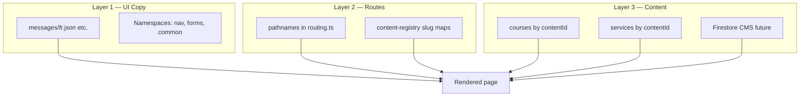
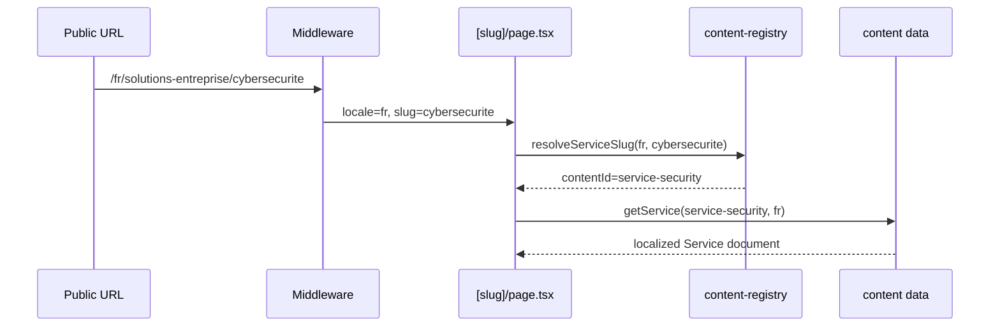
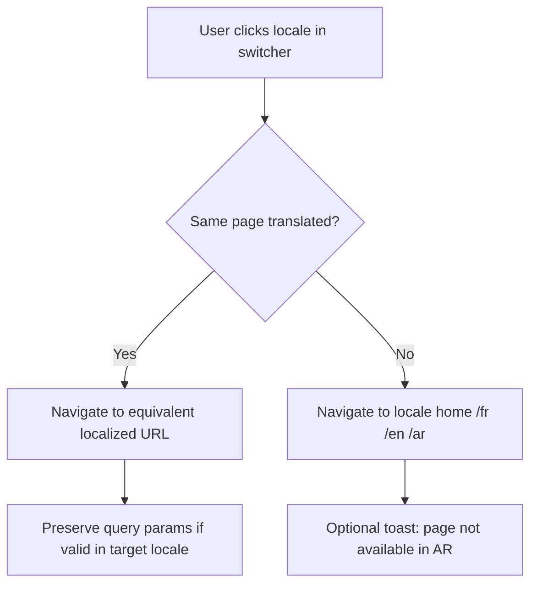

# SYNET Multilingual Architecture — next-intl

> **Document type:** Internationalization architecture reference  
> **Version:** 1.0  
> **Last updated:** 2026-06-08  
> **Stack:** Next.js 16 App Router · next-intl · TypeScript  
> **Companion docs:** [SYNET-UX-IA-REPORT.md](./SYNET-UX-IA-REPORT.md), [SYNET-SEO-STRATEGY.md](./SYNET-SEO-STRATEGY.md), [SYNET-DESIGN-SYSTEM.md](./SYNET-DESIGN-SYSTEM.md)  
> **Status:** Approved for planning — migration from custom i18n  

This document defines SYNET's complete multilingual architecture: folder structure, translation layers, SEO-friendly localized URLs, RTL support, language switcher behavior, and next-intl integration patterns.

---

## Table of contents

1. [Executive summary](#1-executive-summary)
2. [Design goals & constraints](#2-design-goals--constraints)
3. [Three-layer translation model](#3-three-layer-translation-model)
4. [Folder structure](#4-folder-structure)
5. [Routing architecture](#5-routing-architecture)
6. [next-intl configuration](#6-next-intl-configuration)
7. [Translation strategy](#7-translation-strategy)
8. [Content registry (courses & services)](#8-content-registry-courses--services)
9. [Localized pages](#9-localized-pages)
10. [Localized metadata](#10-localized-metadata)
11. [Localized forms](#11-localized-forms)
12. [Localized navigation](#12-localized-navigation)
13. [SEO strategy](#13-seo-strategy)
14. [Language switching UX](#14-language-switching-ux)
15. [Arabic RTL best practices](#15-arabic-rtl-best-practices)
16. [Middleware pipeline](#16-middleware-pipeline)
17. [Migration from current implementation](#17-migration-from-current-implementation)
18. [Testing checklist](#18-testing-checklist)
19. [Anti-patterns](#19-anti-patterns)

---

## 1. Executive summary

SYNET uses **path-prefix i18n** with three locales:

| Locale | Code | Default | Direction | Primary market |
|--------|------|---------|-----------|----------------|
| French | `fr` | ✓ (`x-default`) | LTR | Morocco, Francophone Africa |
| English | `en` | | LTR | International, expat businesses |
| Arabic | `ar` | | RTL | Morocco, MENA |

**Public URL pattern:**

```
https://synet.ma/{locale}/{localized-path}/{localized-slug}
```

**Internal App Router pattern (simplified with next-intl):**

```
src/app/[locale]/(marketing)/...
```

**Key architectural decision:** Separate **UI translations** (next-intl JSON), **route translations** (next-intl `pathnames` + slug registry), and **content translations** (per-locale course/service data keyed by `contentId`). Never machine-translate published content.

---

## 2. Design goals & constraints

| Goal | Requirement |
|------|-------------|
| SEO-friendly URLs | Locale in path; localized slugs per language; no `?lang=` |
| RTL support | Native Arabic layout, fonts, mirrored icons |
| Language switcher | Equivalent page when translation exists; graceful fallback |
| Localized metadata | Unique title, description, canonical, hreflang per locale |
| Localized forms | Labels, errors, options in active locale; server validation messages |
| Localized navigation | Nav labels + hrefs resolve to localized paths |
| Localized course/service pages | Full body content per locale, not UI-only translation |
| Scalability | Add `de`, `es` later without URL redesign |
| Type safety | TypeScript for messages, pathnames, content IDs |

### Current state (pre-migration)

| Piece | Today | Target |
|-------|-------|--------|
| Locale config | `src/lib/i18n/config.ts` | `src/i18n/routing.ts` |
| UI strings | `dictionaries/{fr,en,ar}.ts` | `messages/{fr,en,ar}/*.json` |
| Middleware | Custom locale redirect + rewrites | `next-intl` middleware + optional rewrites |
| Language switcher | Links to `/{locale}` only | Equivalent pathname + slug mapping |
| `dir` / `lang` | Client `useEffect` on `<html>` | Server-set in `[locale]/layout.tsx` |
| Metadata | Partial `generateMetadata` | Full hreflang via `alternates.languages` |

---

## 3. Three-layer translation model



| Layer | What | Who maintains | Format |
|-------|------|---------------|--------|
| **1 — UI** | Buttons, labels, errors, nav text | Developers + copywriters | next-intl JSON namespaces |
| **2 — Routes** | Path segments, URL slugs | Developers | `routing.ts` + `content-registry.ts` |
| **3 — Content** | Course/service/page body | Content team / CMS | TS modules → Firestore |

**Rule:** Layer 1 never contains course syllabi or service descriptions. Layer 3 never contains "Submit" button text.

---

## 4. Folder structure

### Target structure (post-migration)

```
pro3/
├── messages/                              # Layer 1 — UI translations
│   ├── fr/
│   │   ├── common.json
│   │   ├── nav.json
│   │   ├── home.json
│   │   ├── forms.json
│   │   ├── training.json
│   │   ├── solutions.json
│   │   ├── footer.json
│   │   └── metadata.json
│   ├── en/
│   │   └── … (mirror namespaces)
│   └── ar/
│       └── … (mirror namespaces)
│
├── src/
│   ├── i18n/                              # next-intl core
│   │   ├── routing.ts                     # locales, defaultLocale, pathnames
│   │   ├── request.ts                     # getRequestConfig — load messages
│   │   ├── navigation.ts                  # createNavigation — Link, useRouter, etc.
│   │   └── content-registry.ts            # Layer 2 — contentId ↔ slug per locale
│   │
│   ├── middleware.ts                        # createMiddleware(routing) + matcher
│   │
│   ├── lib/
│   │   ├── content/
│   │   │   ├── courses/
│   │   │   │   ├── index.ts               # getCourse(contentId, locale)
│   │   │   │   ├── registry.ts            # contentId definitions
│   │   │   │   └── data/
│   │   │   │       ├── course-networking.fr.ts
│   │   │   │       ├── course-networking.en.ts
│   │   │   │       └── course-networking.ar.ts
│   │   │   └── services/
│   │   │       ├── index.ts
│   │   │       ├── registry.ts
│   │   │       └── data/
│   │   │           └── …
│   │   ├── seo/
│   │   │   ├── metadata.ts                # buildPageMetadata()
│   │   │   └── alternates.ts              # hreflang builder
│   │   └── validation/
│   │       ├── enrollment.schema.ts       # Zod — locale-aware messages
│   │       └── quote.schema.ts
│   │
│   ├── components/
│   │   ├── i18n/
│   │   │   ├── LanguageSwitcher.tsx
│   │   │   ├── LocaleHtmlAttributes.tsx   # Remove after server dir/lang
│   │   │   └── RtlIcon.tsx                # Direction-aware chevrons
│   │   └── …
│   │
│   └── app/
│       ├── layout.tsx                     # Fonts only — no lang (child sets)
│       ├── not-found.tsx
│       └── [locale]/
│           ├── layout.tsx                 # NextIntlClientProvider, dir, lang
│           ├── page.tsx                   # Home
│           │
│           ├── solutions/                 # Internal path (canonical for next-intl)
│           │   ├── page.tsx               # Hub
│           │   ├── [slug]/page.tsx        # Service detail
│           │   └── quote/page.tsx
│           │
│           ├── training/
│           │   ├── page.tsx
│           │   ├── [slug]/page.tsx
│           │   └── enroll/page.tsx
│           │
│           ├── contact/page.tsx
│           ├── about/page.tsx
│           └── …
│
├── global.d.ts                            # next-intl TypeScript augmentation
└── next.config.ts                         # createNextIntlPlugin()
```

### Namespace map (messages)

| Namespace | Contents |
|-----------|----------|
| `common` | Skip link, loading, errors, pagination, badges |
| `nav` | Header groups, mobile menu, CTAs |
| `home` | Hero, overviews, testimonials labels, sections |
| `training` | Hub copy, catalog filters, course UI chrome |
| `solutions` | Hub copy, service UI chrome |
| `forms` | Enrollment + quote + contact labels/errors/success |
| `footer` | Columns, legal, contact |
| `metadata` | Default site title/description templates |

### Why keep internal `/solutions` and `/training` routes?

next-intl `pathnames` maps **public localized URLs** to **internal file-system routes**:

| Public (FR) | Internal route |
|-------------|----------------|
| `/fr/solutions-entreprise/cybersecurite` | `/[locale]/solutions/cybersecurite` |
| `/en/business-solutions/cybersecurity` | `/[locale]/solutions/cybersecurity` |

Internal routes use **locale-specific slug** as `[slug]` param value. The page looks up content by slug → `contentId` → locale data.

---

## 5. Routing architecture

### 5.1 URL matrix

| Page | FR | EN | AR |
|------|----|----|-----|
| Home | `/fr` | `/en` | `/ar` |
| Business hub | `/fr/solutions-entreprise` | `/en/business-solutions` | `/ar/business-solutions` |
| Service detail | `/fr/solutions-entreprise/{slug}` | `/en/business-solutions/{slug}` | `/ar/business-solutions/{slug}` |
| Quote form | `/fr/demande-devis` | `/en/request-quote` | `/ar/request-quote` |
| Training hub | `/fr/centre-formation` | `/en/training-center` | `/ar/training-center` |
| Course detail | `/fr/centre-formation/{slug}` | `/en/training-center/{slug}` | `/ar/training-center/{slug}` |
| Enrollment | `/fr/inscription-formation` | `/en/training-enrollment` | `/ar/training-enrollment` |
| Contact | `/fr/contact` | `/en/contact` | `/ar/contact` |
| About | `/fr/a-propos` | `/en/about` | `/ar/about` |

### 5.2 Slug localization (content IDs)

Services and courses use **different slugs per locale** but share a stable `contentId`:

| contentId | FR slug | EN slug | AR slug |
|-----------|---------|---------|---------|
| `service-network` | `infrastructure-reseau` | `network-infrastructure` | `network-infrastructure` |
| `service-security` | `cybersecurite` | `cybersecurity` | `cybersecurity` |
| `service-voip` | `voip-telephonie-ip` | `voip-ip-telephony` | `voip-ip-telephony` |
| `service-web` | `developpement-web` | `web-development` | `web-development` |
| `service-cloud` | `solutions-cloud` | `cloud-solutions` | `cloud-solutions` |
| `service-support` | `support-maintenance-it` | `it-support-maintenance` | `it-support-maintenance` |
| `service-cctv` | `videosurveillance-controle-acces` | `cctv-access-control` | `cctv-access-control` |
| `course-networking` | `formation-reseaux` | `networking-training` | `networking-training` |
| `course-linux` | `formation-linux` | `linux-training` | `linux-training` |
| `course-security` | `formation-cybersecurite` | `cybersecurity-training` | `cybersecurity-training` |
| `course-cloud` | `formation-cloud` | `cloud-computing` | `cloud-computing` |
| `course-sap` | `formation-sap` | `sap-training` | `sap-training` |
| `course-microsoft` | `technologies-microsoft` | `microsoft-technologies` | `microsoft-technologies` |
| `course-corporate` | `formation-entreprise` | `corporate-training` | `corporate-training` |

### 5.3 Dynamic route resolution flow



---

## 6. next-intl configuration

### 6.1 `src/i18n/routing.ts`

```typescript
import { defineRouting } from "next-intl/routing";

export const locales = ["fr", "en", "ar"] as const;
export type Locale = (typeof locales)[number];
export const defaultLocale = "fr" satisfies Locale;

export const routing = defineRouting({
  locales,
  defaultLocale,
  localePrefix: "always",        // /fr, /en, /ar — never bare paths in production
  alternateLinks: false,           // We build hreflang manually (slug-aware)
  pathnames: {
    "/": "/",
    "/solutions": {
      fr: "/solutions-entreprise",
      en: "/business-solutions",
      ar: "/business-solutions",
    },
    "/solutions/[slug]": {
      fr: "/solutions-entreprise/[slug]",
      en: "/business-solutions/[slug]",
      ar: "/business-solutions/[slug]",
    },
    "/solutions/quote": {
      fr: "/demande-devis",
      en: "/request-quote",
      ar: "/request-quote",
    },
    "/training": {
      fr: "/centre-formation",
      en: "/training-center",
      ar: "/training-center",
    },
    "/training/[slug]": {
      fr: "/centre-formation/[slug]",
      en: "/training-center/[slug]",
      ar: "/training-center/[slug]",
    },
    "/training/enroll": {
      fr: "/inscription-formation",
      en: "/training-enrollment",
      ar: "/training-enrollment",
    },
    "/contact": {
      fr: "/contact",
      en: "/contact",
      ar: "/contact",
    },
    "/about": {
      fr: "/a-propos",
      en: "/about",
      ar: "/about",
    },
  },
});
```

### 6.2 `src/i18n/request.ts`

```typescript
import { getRequestConfig } from "next-intl/server";
import { routing } from "./routing";

const namespaces = [
  "common", "nav", "home", "training", "solutions",
  "forms", "footer", "metadata",
] as const;

export default getRequestConfig(async ({ requestLocale }) => {
  let locale = await requestLocale;
  if (!locale || !routing.locales.includes(locale as typeof routing.locales[number])) {
    locale = routing.defaultLocale;
  }

  const messages = Object.fromEntries(
    await Promise.all(
      namespaces.map(async (ns) => [
        ns,
        (await import(`../../messages/${locale}/${ns}.json`)).default,
      ]),
    ),
  );

  return { locale, messages };
});
```

### 6.3 `src/i18n/navigation.ts`

```typescript
import { createNavigation } from "next-intl/navigation";
import { routing } from "./routing";

export const { Link, redirect, usePathname, useRouter, getPathname } =
  createNavigation(routing);
```

### 6.4 `src/middleware.ts`

```typescript
import createMiddleware from "next-intl/middleware";
import { routing } from "./i18n/routing";

export default createMiddleware(routing);

export const config = {
  matcher: ["/((?!api|_next|_vercel|admin|.*\\..*).*)"],
};
```

> **Note:** Custom rewrite middleware for training/solutions can be **removed** once `pathnames` is active — next-intl handles localized external paths natively.

### 6.5 `next.config.ts`

```typescript
import createNextIntlPlugin from "next-intl/plugin";

const withNextIntl = createNextIntlPlugin("./src/i18n/request.ts");

export default withNextIntl({
  // existing config
});
```

### 6.6 TypeScript augmentation — `global.d.ts`

```typescript
import type { routing } from "./src/i18n/routing";
import type common from "./messages/fr/common.json";

type Messages = typeof common; // extend via interface merging per namespace

declare module "next-intl" {
  interface AppConfig {
    Locale: (typeof routing.locales)[number];
    Messages: Messages;
  }
}
```

---

## 7. Translation strategy

### 7.1 What goes in JSON (Layer 1)

| Include | Exclude |
|---------|---------|
| Navigation labels | Course descriptions |
| Form labels, placeholders, errors | Service benefit paragraphs |
| Button text, section headings (chrome) | Blog post bodies |
| Empty states, filter labels | Legal page full text (use content layer or MDX) |
| `metadata` templates with `{placeholders}` | SEO titles for money pages (Layer 3 + metadata builder) |

### 7.2 Message key conventions

```
{namespace}.{section}.{element}

Examples:
nav.business.services.label
forms.enrollment.errors.email
training.catalog.searchPlaceholder
solutions.quote.submit
metadata.service.title          # Template: "{name} Maroc | SYNET"
```

### 7.3 ICU message format

Use ICU for plurals and variables:

```json
{
  "training": {
    "catalog": {
      "resultsCount": "{count, plural, =0 {Aucune formation} one {# formation} other {# formations}}"
    }
  }
}
```

```tsx
const t = await getTranslations("training.catalog");
t("resultsCount", { count: 7 });
```

### 7.4 Content translation workflow

```
draft → review → published   (per locale, independent)
```

| State | Public site | hreflang |
|-------|-------------|----------|
| FR published, EN draft | FR indexed; EN switcher falls back to `/en/` | EN not in cluster |
| All 3 published | Full cluster | `fr`, `en`, `ar`, `x-default` |

### 7.5 Arabic content rules

- Professional human translation — no MT for publish
- Technical terms may stay Latin: `CCNA`, `SAP`, `VoIP`, `Linux`
- Numbers in Arabic locale: use `Intl.NumberFormat('ar-MA')` for display
- Dates: `Intl.DateTimeFormat('ar-MA', { dateStyle: 'long' })`

---

## 8. Content registry (courses & services)

### `src/i18n/content-registry.ts`

Central source of truth for Layer 2 slug mapping and language switcher.

```typescript
import type { Locale } from "./routing";

export type ServiceContentId =
  | "service-network" | "service-security" | "service-voip"
  | "service-web" | "service-cloud" | "service-support" | "service-cctv";

export type CourseContentId =
  | "course-networking" | "course-linux" | "course-security"
  | "course-cloud" | "course-sap" | "course-microsoft" | "course-corporate";

export const serviceSlugs: Record<ServiceContentId, Record<Locale, string>> = {
  "service-security": {
    fr: "cybersecurite",
    en: "cybersecurity",
    ar: "cybersecurity",
  },
  // … all 7 services
};

export const courseSlugs: Record<CourseContentId, Record<Locale, string>> = {
  "course-networking": {
    fr: "formation-reseaux",
    en: "networking-training",
    ar: "networking-training",
  },
  // … all 7 courses
};

export function resolveServiceContentId(
  locale: Locale,
  slug: string,
): ServiceContentId | null {
  return (Object.entries(serviceSlugs) as [ServiceContentId, Record<Locale, string>][])
    .find(([, slugs]) => slugs[locale] === slug)?.[0] ?? null;
}

export function getServiceSlug(contentId: ServiceContentId, locale: Locale): string {
  return serviceSlugs[contentId][locale];
}

// Mirror for courses: resolveCourseContentId, getCourseSlug
```

### Content loader pattern

```typescript
// src/lib/content/services/index.ts
export function getService(contentId: ServiceContentId, locale: Locale): Service {
  return serviceData[contentId][locale];
}

export function getServiceBySlug(locale: Locale, slug: string): Service | null {
  const id = resolveServiceContentId(locale, slug);
  return id ? getService(id, locale) : null;
}
```

---

## 9. Localized pages

### 9.1 Page implementation pattern

```tsx
// src/app/[locale]/solutions/[slug]/page.tsx
import { notFound } from "next/navigation";
import { getTranslations, setRequestLocale } from "next-intl/server";
import { getServiceBySlug } from "@/lib/content/services";
import { buildServiceMetadata } from "@/lib/seo/metadata";
import { routing, type Locale } from "@/i18n/routing";

type Props = { params: Promise<{ locale: Locale; slug: string }> };

export function generateStaticParams() {
  return routing.locales.flatMap((locale) =>
    getAllServiceSlugs(locale).map((slug) => ({ locale, slug })),
  );
}

export async function generateMetadata({ params }: Props) {
  const { locale, slug } = await params;
  const service = getServiceBySlug(locale, slug);
  if (!service) return {};
  return buildServiceMetadata({ locale, service });
}

export default async function ServicePage({ params }: Props) {
  const { locale, slug } = await params;
  setRequestLocale(locale);

  const service = getServiceBySlug(locale, slug);
  if (!service) notFound();

  const t = await getTranslations("solutions");

  return (
    <>
      <ServiceHero service={service} />
      <ServiceBenefits items={service.benefits} heading={t("detail.benefits")} />
      {/* Content from Layer 3; chrome from Layer 1 */}
    </>
  );
}
```

### 9.2 `generateStaticParams` rule

Generate **per locale × per slug** — never cross-mix slugs:

```typescript
// ✓ Correct
{ locale: "fr", slug: "cybersecurite" }
{ locale: "en", slug: "cybersecurity" }

// ✗ Wrong
{ locale: "en", slug: "cybersecurite" }
```

### 9.3 Locale layout

```tsx
// src/app/[locale]/layout.tsx
import { NextIntlClientProvider } from "next-intl";
import { getMessages, setRequestLocale } from "next-intl/server";
import { notFound } from "next/navigation";
import { routing, type Locale } from "@/i18n/routing";
import { getDirection } from "@/lib/i18n/locale-utils";

export function generateStaticParams() {
  return routing.locales.map((locale) => ({ locale }));
}

export default async function LocaleLayout({
  children,
  params,
}: {
  children: React.ReactNode;
  params: Promise<{ locale: string }>;
}) {
  const { locale } = await params;
  if (!routing.locales.includes(locale as Locale)) notFound();

  setRequestLocale(locale as Locale);
  const messages = await getMessages();
  const dir = getDirection(locale as Locale);

  return (
    <html lang={locale} dir={dir} suppressHydrationWarning>
      <body>
        <NextIntlClientProvider messages={messages}>
          <Header />
          <main id="main-content">{children}</main>
          <Footer />
        </NextIntlClientProvider>
      </body>
    </html>
  );
}
```

> **Important:** Move `<html>`/`<body>` from root `layout.tsx` to `[locale]/layout.tsx` so `lang` and `dir` are correct on first paint (no client flash). Root layout becomes a passthrough or only loads fonts via CSS variables on a wrapper.

---

## 10. Localized metadata

### 10.1 Metadata builder

```typescript
// src/lib/seo/metadata.ts
import type { Metadata } from "next";
import type { Locale } from "@/i18n/routing";
import { getServiceSlug, type ServiceContentId } from "@/i18n/content-registry";
import { getPathname } from "@/i18n/navigation";
import { getService } from "@/lib/content/services";

const siteUrl = process.env.NEXT_PUBLIC_SITE_URL ?? "https://synet.ma";

export function buildServiceMetadata({
  locale,
  contentId,
}: {
  locale: Locale;
  contentId: ServiceContentId;
}): Metadata {
  const service = getService(contentId, locale);
  const slug = getServiceSlug(contentId, locale);

  const pathname = getPathname({
    locale,
    href: { pathname: "/solutions/[slug]", params: { slug } },
  });
  const canonical = `${siteUrl}${pathname}`;

  const languages = buildHreflangService(contentId);

  return {
    title: service.seo.title,           // Layer 3 — per SEO strategy doc
    description: service.seo.description,
    alternates: { canonical, languages },
    openGraph: {
      title: service.seo.title,
      description: service.seo.description,
      url: canonical,
      locale: ogLocaleMap[locale],
      type: "website",
    },
    robots: service.published ? { index: true, follow: true } : { index: false },
  };
}
```

### 10.2 hreflang builder (slug-aware)

```typescript
export function buildHreflangService(contentId: ServiceContentId) {
  const languages: Record<string, string> = {};
  for (const locale of routing.locales) {
    const service = getService(contentId, locale);
    if (!service?.published) continue;
    const slug = getServiceSlug(contentId, locale);
    const path = getPathname({
      locale,
      href: { pathname: "/solutions/[slug]", params: { slug } },
    });
    languages[locale] = `${siteUrl}${path}`;
  }
  languages["x-default"] = languages.fr ?? `${siteUrl}/fr`;
  return languages;
}
```

### 10.3 Metadata sources by page type

| Page | Title/description source |
|------|--------------------------|
| Home | `messages/{locale}/metadata.json` + overrides |
| Hub | `training.json` / `solutions.json` hub meta fields |
| Service/Course | Layer 3 `seo.title`, `seo.description` (SEO strategy doc) |
| Forms | `forms.*.metaTitle` in JSON |
| Legal | Content layer per locale |

---

## 11. Localized forms

### 11.1 Structure

All form UI from `messages/{locale}/forms.json`:

```json
{
  "enrollment": {
    "metaTitle": "Inscription formation | SYNET",
    "title": "Inscrivez-vous à une formation",
    "fields": {
      "fullName": { "label": "Nom complet", "placeholder": "Votre nom" },
      "email": { "label": "E-mail" }
    },
    "errors": {
      "required": "Ce champ est obligatoire",
      "email": "Adresse e-mail invalide"
    },
    "success": {
      "title": "Demande envoyée",
      "body": "Notre équipe vous contactera sous 24 h."
    },
    "experience": {
      "none": "Aucune expérience",
      "beginner": "Débutant"
    }
  },
  "quote": { }
}
```

### 11.2 Client form with next-intl

```tsx
"use client";

import { useTranslations } from "next-intl";
import { useForm } from "react-hook-form";
import { zodResolver } from "@hookform/resolvers/zod";
import { createEnrollmentSchema } from "@/lib/validation/enrollment.schema";

export function EnrollmentForm({ courses, preselectedSlug }: Props) {
  const t = useTranslations("forms.enrollment");
  const schema = createEnrollmentSchema(t); // Zod messages from translations

  const form = useForm({
    resolver: zodResolver(schema),
  });

  return (
    <form>
      <FormField label={t("fields.fullName.label")} … />
    </form>
  );
}
```

### 11.3 Zod schema factory

```typescript
export function createEnrollmentSchema(t: Translator<"forms.enrollment">) {
  return z.object({
    fullName: z.string().min(1, t("errors.required")),
    email: z.string().email(t("errors.email")),
    // …
  });
}
```

### 11.4 Form submission payload

Always include `locale` in API payload for email templates and CRM routing:

```typescript
{ …fields, locale: "fr", sourceUrl: "/fr/inscription-formation?course=formation-reseaux" }
```

### 11.5 Query parameters

| Param | Localized? | Canonical |
|-------|------------|-----------|
| `?course={slug}` | Yes — slug is locale-specific | Strip from canonical |
| `?service={slug}` | Yes | Strip from canonical |

Preselect uses **current locale's slug** from content registry.

---

## 12. Localized navigation

### 12.1 Nav message + path composition

Nav labels from `messages/nav.json`. Hrefs from next-intl `Link` with typed pathnames:

```tsx
import { Link } from "@/i18n/navigation";
import { useTranslations } from "next-intl";
import { getServiceSlug } from "@/i18n/content-registry";

export function BusinessNav() {
  const t = useTranslations("nav.business");

  return (
    <Link href={{ pathname: "/solutions/[slug]", params: { slug: getServiceSlug("service-security", locale) } }}>
      {t("cybersecurity")}
    </Link>
  );
}
```

### 12.2 Static nav pathnames

```tsx
<Link href="/solutions">{t("hub")}</Link>
<Link href="/training">{t("trainingHub")}</Link>
<Link href="/solutions/quote">{t("requestQuote")}</Link>
```

next-intl resolves these to localized public URLs automatically.

### 12.3 Footer

Footer links mirror header — same `Link` + `getServiceSlug` / `getCourseSlug` pattern. Legal paths:

| Key | pathname in routing |
|-----|---------------------|
| Legal | `/legal` → `{ fr: '/mentions-legales', en: '/legal-notice', ar: '...' }` |

---

## 13. SEO strategy

### 13.1 Integration with SEO doc

| SEO requirement | i18n implementation |
|-----------------|---------------------|
| Path-prefix locales | `localePrefix: "always"` |
| Localized slugs | `content-registry.ts` |
| hreflang | `buildHreflang*` in `alternates.ts` — skip unpublished locales |
| x-default → fr | `languages["x-default"] = languages.fr` |
| No `?lang=` | Never — switcher uses pathname |
| Canonical per locale | `alternates.canonical` per page |
| Arabic RTL indexed | Separate `/ar/` URLs — same as LTR locales |
| Sitemaps | `sitemap-fr.xml`, `sitemap-en.xml`, `sitemap-ar.xml` — slug per locale |

### 13.2 Sitemap generation

```typescript
// app/sitemap.ts or per-locale sitemap route
for (const locale of locales) {
  for (const contentId of serviceContentIds) {
    const service = getService(contentId, locale);
    if (!service.published) continue;
    entries.push({
      url: `${siteUrl}${getPathname({ locale, href: { pathname: "/solutions/[slug]", params: { slug: getServiceSlug(contentId, locale) } } })}`,
      alternates: { languages: buildHreflangService(contentId) },
    });
  }
}
```

### 13.3 `generateStaticParams` + SEO

All money pages pre-rendered at build — no CSR-only content for crawlers.

---

## 14. Language switching UX

### 14.1 Behavior rules



| Scenario | Result |
|----------|--------|
| FR service → EN | `/fr/solutions-entreprise/cybersecurite` → `/en/business-solutions/cybersecurity` |
| FR course → AR | `/fr/centre-formation/formation-reseaux` → `/ar/training-center/networking-training` |
| Blog post EN only | Switch to AR → `/ar/` (home) |
| Enrollment with `?course=` | Map slug via `contentId` → target locale slug |
| Admin | No language switcher — admin UI fixed FR |

### 14.2 LanguageSwitcher implementation

```tsx
"use client";

import { useLocale } from "next-intl";
import { usePathname, useRouter } from "@/i18n/navigation";
import { routing, type Locale } from "@/i18n/routing";
import { resolveLocalizedPathname } from "@/i18n/switch-locale";

export function LanguageSwitcher() {
  const locale = useLocale() as Locale;
  const pathname = usePathname(); // internal pathname e.g. /solutions/[slug]
  const router = useRouter();

  function switchTo(nextLocale: Locale) {
    const href = resolveLocalizedPathname({
      pathname,
      params: currentParams, // from page context or URL parse
      sourceLocale: locale,
      targetLocale: nextLocale,
    });
    router.replace(href, { locale: nextLocale });
  }

  return (/* FR | EN | AR */);
}
```

### 14.3 `switch-locale.ts` (core logic)

```typescript
export function resolveLocalizedPathname({
  pathname,
  params,
  sourceLocale,
  targetLocale,
}: {
  pathname: string;
  params: Record<string, string>;
  sourceLocale: Locale;
  targetLocale: Locale;
}): { pathname: string; params?: Record<string, string> } | string {
  // Dynamic service slug
  if (pathname === "/solutions/[slug]" && params.slug) {
    const contentId = resolveServiceContentId(sourceLocale, params.slug);
    if (!contentId) return "/";
    const targetSlug = getServiceSlug(contentId, targetLocale);
    if (!getService(contentId, targetLocale)?.published) return "/";
    return { pathname: "/solutions/[slug]", params: { slug: targetSlug } };
  }
  // Mirror for /training/[slug]
  // Static paths: next-intl router handles via pathnames
  return pathname;
}
```

### 14.4 UI specification

| Element | Spec |
|---------|------|
| Position | Header top-right |
| Format | `FR \| EN \| AR` |
| Active | `aria-current="true"`, navy/white (no link) |
| Inactive | Link, hover underline |
| Mobile | Same, in drawer footer |
| Keyboard | Tab between links; Enter activates |
| Touch target | Min 44×44px per locale |

### 14.5 Accessibility

```html
<nav aria-label="Language selection">
  <ul>
    <li><span aria-current="true">FR</span></li>
    <li><a href="…" lang="en">EN</a></li>
    <li><a href="…" lang="ar">AR</a></li>
  </ul>
</nav>
```

Use `lang` attribute on each link for screen readers.

---

## 15. Arabic RTL best practices

### 15.1 Document direction

| Item | Implementation |
|------|----------------|
| `dir` | `dir="rtl"` on `<html>` when `locale === "ar"` |
| `lang` | `lang="ar"` |
| Font | `Noto Sans Arabic` via `--font-arabic-family` |
| Body font stack | `locale === "ar" ? var(--font-arabic) : var(--font-primary)` |

```css
/* globals.css */
[dir="rtl"] body {
  font-family: var(--font-arabic-family), var(--font-primary), sans-serif;
}
```

### 15.2 Tailwind — logical properties only

| Avoid | Use |
|-------|-----|
| `ml-4`, `mr-4` | `ms-4`, `me-4` |
| `pl-6`, `pr-6` | `ps-6`, `pe-6` |
| `left-0`, `right-0` | `start-0`, `end-0` |
| `text-left` | `text-start` |
| `float-left` | `float-start` |
| `border-l-4` | `border-s-4` |

**Codebase rule:** ESLint plugin or PR checklist — no physical `left`/`right` in new components.

### 15.3 Icons & chevrons

| Icon type | RTL behavior |
|-----------|--------------|
| Chevrons, arrows | Mirror horizontally |
| Phone, shield, cloud | Do not mirror |
| Progress timelines | Reverse flow in RTL |
| Charts | Keep LTR for numbers (optional LTR island) |

```tsx
// RtlIcon.tsx
export function ChevronForward({ className }: { className?: string }) {
  return (
    <ChevronRight
      className={cn(className, "rtl:rotate-180")}
      aria-hidden
    />
  );
}
```

### 15.4 Mixed-direction content

Technical terms and URLs embedded in Arabic text:

```tsx
<span dir="rtl">تدريب <span dir="ltr">CCNA</span> في المغرب</span>
```

Or use Unicode bidi isolates: `\u2068` FSI, `\u2069` PDI.

### 15.5 Forms in RTL

- Labels align `text-start` (right in RTL)
- Input text direction: `email`, `url`, `tel` → `dir="ltr"` on input
- Error messages follow label alignment
- Select dropdowns: native OS handles RTL

### 15.6 Numbers & dates

| Content | Display |
|---------|---------|
| Phone numbers | LTR inline: `+212 5XX XXX XXX` |
| Prices | `Intl.NumberFormat('ar-MA', { style: 'currency', currency: 'MAD' })` |
| Dates | Arabic month names via `Intl` |
| Counters/stats | Western digits (`123`) — common in MA business sites; configurable |

### 15.7 Layout QA checklist (Arabic)

- [ ] Header logo and nav flip correctly
- [ ] Mega-menu columns order reversed
- [ ] Breadcrumb separator flips (`<` vs `>`)
- [ ] Hero CTA button order preserved (primary first in reading order)
- [ ] Testimonial carousel prev/next reversed
- [ ] Footer columns mirror
- [ ] Skip link uses `focus:start-4`
- [ ] No horizontal overflow on mobile
- [ ] PDF/download links work with Arabic filenames

### 15.8 Typography adjustments

| Property | LTR | RTL |
|----------|-----|-----|
| Line height | 1.5 | 1.7 (Arabic needs more leading) |
| Heading weight | 600 | 600 (Noto Sans Arabic supports) |
| Max line length | 65ch | 60ch |

---

## 16. Middleware pipeline

### Order of execution

```
Request
  → next-intl middleware (locale detect, redirect / → /fr, prefix)
  → Next.js routing (match [locale] segment)
  → Page render
```

### Locale detection priority

1. URL prefix (`/en/...`) — **authoritative**
2. Cookie `NEXT_LOCALE` (next-intl optional) — for `/` redirect preference only
3. `Accept-Language` header — **only** on first visit to `/`; redirect once, then URL wins
4. Default `fr`

**Do not** use `Accept-Language` on every request — hurts SEO (inconsistent URLs).

### Matcher exclusions

```
api, _next, admin, favicon.ico, sitemap*.xml, robots.txt, static assets
```

---

## 17. Migration from current implementation

### Phase 1 — Install & scaffold (Week 1)

- [ ] `npm install next-intl`
- [ ] Add `src/i18n/routing.ts`, `request.ts`, `navigation.ts`
- [ ] Update `next.config.ts` with plugin
- [ ] Replace `middleware.ts` with `createMiddleware`
- [ ] Split `dictionaries/fr.ts` → `messages/fr/*.json` (automated script)

### Phase 2 — Routes (Week 1–2)

- [ ] Add `pathnames` for all static routes
- [ ] Create `content-registry.ts`
- [ ] Refactor course/service data to `contentId` keyed structure
- [ ] Remove custom `resolveTrainingRewrite` / `resolveSolutionsRewrite`
- [ ] Update `generateStaticParams` per locale slug lists

### Phase 3 — Components (Week 2)

- [ ] Replace `getDictionary()` with `getTranslations()`
- [ ] Swap `next/link` → `@/i18n/navigation` `Link`
- [ ] Implement `LanguageSwitcher` with `resolveLocalizedPathname`
- [ ] Move `lang`/`dir` to server layout; remove `LocaleHtmlAttributes` client hack

### Phase 4 — SEO (Week 2–3)

- [ ] `buildServiceMetadata` / `buildCourseMetadata` with hreflang
- [ ] Per-locale sitemaps
- [ ] Validate in GSC hreflang report

### Phase 5 — Forms & validation (Week 3)

- [ ] `forms.json` per locale
- [ ] Zod schema factories with `t()` messages
- [ ] Locale in submission payload

### Backward compatibility

301 redirects for any changed URLs (none expected if pathnames match current public URLs).

---

## 18. Testing checklist

| Test | FR | EN | AR |
|------|----|----|-----|
| Home renders | ✓ | ✓ | ✓ |
| Correct `lang` + `dir` | ltr | ltr | rtl |
| Service page 200 | cybersecurite | cybersecurity | cybersecurity |
| Course page 200 | formation-reseaux | networking-training | networking-training |
| Language switcher equivalent URL | ✓ | ✓ | ✓ |
| Switcher fallback (draft page) | — | — | → /ar/ |
| hreflang in `<head>` | ✓ | ✓ | ✓ |
| Form validation messages | French | English | Arabic |
| Quote preselect `?service=` | FR slug | EN slug | EN slug |
| RTL layout snapshot | — | — | ✓ |
| `generateStaticParams` build | 60+ pages | | |

### Automated tests

```typescript
describe("content-registry", () => {
  it("resolves FR slug to same contentId as EN", () => {
    expect(resolveServiceContentId("fr", "cybersecurite")).toBe("service-security");
    expect(resolveServiceContentId("en", "cybersecurity")).toBe("service-security");
  });
});
```

---

## 19. Anti-patterns

| Anti-pattern | Why harmful | SYNET alternative |
|--------------|-------------|-------------------|
| `?lang=en` query param | Bad SEO, unshareable | Path prefix |
| Single slug all locales | Misses FR keyword URLs | `content-registry` |
| Machine-translate content | Quality, E-E-A-T | Human per locale |
| `useEffect` for `dir` | FOUC, a11y | Server `layout.tsx` |
| Physical CSS left/right | Breaks RTL | Logical properties |
| UI strings in course data | Unmaintainable | Layer separation |
| `router.push('/en' + pathname)` | Ignores localized paths | `useRouter` from next-intl |
| One giant `messages.json` | Merge conflicts | Namespaced files |
| Hardcoded `/fr/...` in components | Breaks EN/AR | `Link` from navigation |
| `Accept-Language` redirect every request | Crawler confusion | URL prefix only |

---

## Quick reference

| Need | Use |
|------|-----|
| UI text | `getTranslations("namespace")` |
| Typed links | `import { Link } from "@/i18n/navigation"` |
| Current locale | `useLocale()` / `getLocale()` |
| Slug mapping | `content-registry.ts` |
| hreflang | `lib/seo/alternates.ts` |
| RTL | `dir` on html + logical Tailwind |
| Forms | `forms.json` + Zod factory |

---

## Document changelog

| Version | Date | Changes |
|---------|------|---------|
| 1.0 | 2026-06-08 | Initial next-intl architecture specification |

---

*End of document — use this file as the single source of truth for SYNET internationalization decisions.*
