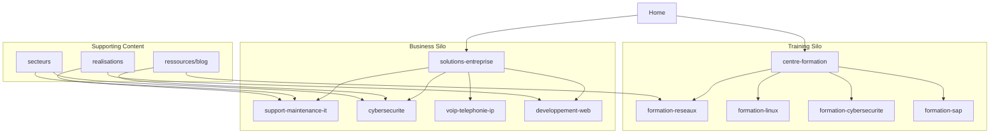

# SYNET SEO Strategy

> **Document type:** SEO reference & execution plan  
> **Version:** 1.0  
> **Last updated:** 2026-06-08  
> **Companion docs:** [SYNET-UX-IA-REPORT.md](./SYNET-UX-IA-REPORT.md), [SYNET-BUSINESS-SOLUTIONS.md](./SYNET-BUSINESS-SOLUTIONS.md), [SYNET-TRAINING-CENTER.md](./SYNET-TRAINING-CENTER.md)  
> **Domain:** `https://synet.ma`  
> **Status:** Approved for planning  

This document defines SYNET's complete SEO strategy: architecture, landing pages, blog plan, internal linking, and metadata templates. It targets high-intent queries in Morocco across Business Solutions and Training Center divisions with equal strategic weight.

---

## Table of contents

1. [Strategic overview](#1-strategic-overview)
2. [Keyword map](#2-keyword-map)
3. [SEO architecture](#3-seo-architecture)
4. [Landing pages](#4-landing-pages)
5. [Blog strategy](#5-blog-strategy)
6. [Internal linking strategy](#6-internal-linking-strategy)
7. [Metadata recommendations](#7-metadata-recommendations)
8. [Structured data](#8-structured-data)
9. [Technical SEO checklist](#9-technical-seo-checklist)
10. [Local SEO (Morocco)](#10-local-seo-morocco)
11. [Measurement & KPIs](#11-measurement--kpis)
12. [90-day execution roadmap](#12-90-day-execution-roadmap)

---

## 1. Strategic overview

### Positioning in search

SYNET competes on **trust + dual expertise** (IT services + professional training). SEO must capture two distinct intent clusters without cannibalization:

| Intent cluster | User | Primary conversion |
|----------------|------|-------------------|
| **Transactional B2B** | IT manager, school admin, clinic owner | Quote request |
| **Transactional training** | Student, job seeker, HR/L&D manager | Enrollment |
| **Informational** | Researchers comparing vendors or courses | Blog → service/course |
| **Local** | "near me" / "Morocco" modifiers | All of the above |

### Core principles

| Principle | Implementation |
|-----------|----------------|
| **One primary keyword per URL** | No two pages target the same head term |
| **Division clarity** | Business pages don't rank for training terms and vice versa |
| **Morocco geo-signals** | "Maroc / Morocco" in titles, H1, schema, footer — not keyword stuffing |
| **French first** | `fr` is default locale, `x-default` hreflang, primary content investment |
| **Manual multilingual** | Independent FR/EN/AR metadata and body — no auto-translate |
| **Earn links through expertise** | Blog + guides support service/course pages |

### Priority keyword tiers (user-specified)

**Business Services (Tier 1)**

| Target keyword | Primary URL (FR) | Priority |
|----------------|------------------|----------|
| IT Support Morocco | `/fr/solutions-entreprise/support-maintenance-it` | P1 |
| Cybersecurity Morocco | `/fr/solutions-entreprise/cybersecurite` | P1 |
| VoIP Morocco | `/fr/solutions-entreprise/voip-telephonie-ip` | P1 |
| Website Development Morocco | `/fr/solutions-entreprise/developpement-web` | P1 |

**Training (Tier 1)**

| Target keyword | Primary URL (FR) | Priority |
|----------------|------------------|----------|
| CCNA Training Morocco | `/fr/centre-formation/formation-reseaux` | P1 |
| Linux Training Morocco | `/fr/centre-formation/formation-linux` | P1 |
| Cybersecurity Training Morocco | `/fr/centre-formation/formation-cybersecurite` | P1 |
| SAP Training Morocco | `/fr/centre-formation/formation-sap` | P1 |

---

## 2. Keyword map

### Business — full keyword universe

| Page | Head term (EN) | FR primary | EN primary | AR primary | Secondary keywords |
|------|----------------|------------|------------|------------|-------------------|
| IT Support | IT Support Morocco | support informatique Maroc | IT support Morocco | دعم تقني المغرب | infogérance Maroc, maintenance IT, helpdesk entreprise |
| Cybersecurity | Cybersecurity Morocco | cybersécurité Maroc | cybersecurity Morocco | الأمن السيبراني المغرب | audit sécurité, firewall, protection données |
| VoIP | VoIP Morocco | VoIP Maroc, téléphonie IP | VoIP Morocco | VoIP المغرب | téléphonie IP entreprise, communication unifiée |
| Web Dev | Website Development Morocco | création site web Maroc | website development Morocco | تطوير مواقع المغرب | développement web, site vitrine, application web |
| Network* | Network infrastructure Morocco | infrastructure réseau Maroc | network infrastructure Morocco | — | Cisco Maroc, LAN/WAN |
| Cloud* | Cloud solutions Morocco | solutions cloud Maroc | cloud solutions Morocco | — | migration cloud, hébergement |
| CCTV* | CCTV Morocco | vidéosurveillance Maroc | CCTV Morocco | — | contrôle d'accès |

\*Tier 2 — supported by existing service pages, not user P1 list.

### Training — full keyword universe

| Page | Head term (EN) | FR primary | EN primary | AR primary | Secondary keywords |
|------|----------------|------------|------------|------------|-------------------|
| CCNA / Networking | CCNA Training Morocco | formation CCNA Maroc | CCNA training Morocco | تدريب CCNA المغرب | formation Cisco, réseaux, CCNA 200-301 |
| Linux | Linux Training Morocco | formation Linux Maroc | Linux training Morocco | تدريب لينكس المغرب | administration Linux, RHCSA, serveur Linux |
| Cybersecurity training | Cybersecurity Training Morocco | formation cybersécurité Maroc | cybersecurity training Morocco | تدريب الأمن السيبراني | ethical hacking, sécurité réseau |
| SAP | SAP Training Morocco | formation SAP Maroc | SAP training Morocco | تدريب SAP المغرب | SAP ERP, module SAP FI/CO |
| Cloud training* | Cloud training Morocco | formation cloud Maroc | — | — | AWS, Azure |
| Microsoft* | Microsoft training Morocco | formation Microsoft Maroc | — | — | MCSA, Windows Server |
| Corporate* | Corporate IT training | formation entreprise sur mesure | — | — | formation équipes IT |

\*Tier 2.

### Cannibalization rules

| Conflict | Resolution |
|----------|------------|
| `cybersecurite` service vs `formation-cybersecurite` | Service page = "cybersécurité entreprise / protection"; Training = "formation cybersécurité / apprendre". Different H1, title, schema (`Service` vs `Course`). |
| Blog post "cybersécurité" | Informational title; links to **one** primary page based on article angle (service or training). |
| Sector pages (schools) mentioning security | Sector page targets "IT écoles Maroc"; links out to service/training — does not replace them. |

---

## 3. SEO architecture

### 3.1 Site hierarchy (crawl depth)

```
Level 0:  /fr/  (Home)
Level 1:  Hubs — solutions-entreprise, centre-formation, secteurs, ressources, a-propos
Level 2:  Money pages — 7 services + 7 courses  ← PRIMARY SEO TARGETS
Level 2:  Conversion — demande-devis, inscription-formation, contact
Level 3:  Blog posts, guides, case studies, sector pages, FAQ
Level 4:  Legal (noindex optional — see §9)
```

**Rule:** Every Tier 1 money page reachable in ≤ 2 clicks from home. Max 3 clicks for blog → money page.

### 3.2 URL architecture

| Pattern | Example | SEO role |
|---------|---------|----------|
| `/{locale}/{hub}/` | `/fr/solutions-entreprise/` | Category hub — targets broad terms + distributes authority |
| `/{locale}/{hub}/{slug}/` | `/fr/centre-formation/formation-reseaux/` | **Primary landing page** — head keyword |
| `/{locale}/secteurs/{sector}/` | `/fr/secteurs/ecoles/` | Long-tail local + vertical |
| `/{locale}/ressources/blog/{slug}/` | `/fr/ressources/blog/pourquoi-ccna-maroc/` | Topical authority → course |
| `/{locale}/realisations/{slug}/` | `/fr/realisations/modernisation-reseau-ecole/` | E-E-A-T proof → service |
| `/{locale}/demande-devis?service=` | Parameterized CTA | **noindex** on parameterized URLs; canonical to clean service page |

**Trailing slashes:** Pick one convention (recommend **with** trailing slash) and enforce 301 redirects.

### 3.3 Locale architecture

```
https://synet.ma/fr/...   ← default, x-default
https://synet.ma/en/...
https://synet.ma/ar/...
```

| Element | FR | EN | AR |
|---------|----|----|-----|
| Priority | 100% content | 80% mirror | 60% phased |
| Keyword style | formation X Maroc | X training Morocco | المغرب + technical terms |
| Indexing | All money pages | All money pages | Money pages when translation complete |
| hreflang | Bidirectional cluster per `translationGroupId` | | |

**Do not index** incomplete AR pages. Admin `draft` locale = `noindex` until published.

### 3.4 Content silos

Two parallel silos with a **bridge** only at hub level (homepage, about, contact):



**Cross-silo links:** Allowed from blog, case studies, and "Why SYNET" — not from service footer to unrelated courses (except corporate training).

### 3.5 Sitemap strategy

| Sitemap | Contents | Update frequency |
|---------|----------|------------------|
| `sitemap-index.xml` | References below | — |
| `sitemap-fr.xml` | All FR indexable URLs | Weekly |
| `sitemap-en.xml` | All EN indexable URLs | Weekly |
| `sitemap-ar.xml` | Published AR only | Weekly |
| `sitemap-images.xml` | Service/course hero images (optional) | Monthly |

**Priority hints (sitemap):**

| URL type | priority | changefreq |
|----------|----------|------------|
| Home | 1.0 | weekly |
| Service + course money pages | 0.9 | monthly |
| Hubs, quote/enroll | 0.8 | monthly |
| Blog (recent) | 0.7 | weekly |
| Blog (archive) | 0.5 | yearly |
| Legal | 0.3 | yearly |

Submit to Google Search Console and Bing Webmaster Tools per locale property or single property with hreflang validation.

### 3.6 Indexation policy

| Index | Noindex |
|-------|---------|
| Published money pages, hubs, blog, FAQ, about, sectors, case studies | Admin, `/api/*`, thank-you pages (optional), search results, filtered catalog views with query params |
| Contact | Index (local intent) |

Use `robots.txt` to disallow `/admin/` only — not staging if on subdomain.

---

## 4. Landing pages

### 4.1 Page types

| Type | Count (MVP+) | Role |
|------|--------------|------|
| **Primary money pages** | 8 services/courses (P1 focus on 8) | Rank for head keywords; convert |
| **Hub pages** | 2 | Category authority; internal link distributor |
| **Sector landing pages** | 5 | Long-tail "IT pour écoles Maroc" |
| **Geo-enhanced variants** | Optional Phase 2 | City pages if justified by content |
| **Comparison / decision pages** | 2–3 guides | "CCNA vs Network+" — funnel to course |
| **Conversion pages** | 2 | Quote + enrollment — long-tail support, not head terms |

### 4.2 Primary business landing pages (P1)

Each page must include for SEO:

- Keyword-rich **H1** (one only) with Morocco modifier
- 800–1,200 words FR body minimum (service description + benefits + local context)
- FAQ block (3–5 questions) — targets featured snippets
- Client sectors served (schools, SMEs, clinics…)
- Casablanca / Morocco service area statement
- Primary CTA: Demander un devis
- Schema: `Service` + `FAQPage`
- Internal links: 3+ related services, 1 sector page, 1 case study (when live)

| Service | FR URL | Recommended H1 |
|---------|--------|----------------|
| IT Support | `/fr/solutions-entreprise/support-maintenance-it/` | Support informatique et maintenance IT au Maroc |
| Cybersecurity | `/fr/solutions-entreprise/cybersecurite/` | Solutions de cybersécurité pour entreprises au Maroc |
| VoIP | `/fr/solutions-entreprise/voip-telephonie-ip/` | Solutions VoIP et téléphonie IP au Maroc |
| Web Development | `/fr/solutions-entreprise/developpement-web/` | Développement de sites web professionnels au Maroc |

**EN H1 equivalents:**

- IT Support & Maintenance in Morocco
- Cybersecurity Solutions for Businesses in Morocco
- VoIP & IP Telephony Solutions in Morocco
- Professional Website Development in Morocco

### 4.3 Primary training landing pages (P1)

Each page must include:

- **H1** with formation + Maroc + certification name where applicable
- Syllabus overview (indexable text, not PDF-only)
- Duration, level, schedule, certification path
- Instructor credentials (E-E-A-T)
- FAQ: "Qui peut s'inscrire?", "Certification incluse?", "Prochaine session?"
- Schema: `Course` with `provider`, `offers`, `hasCourseInstance`
- Primary CTA: S'inscrire à la formation

| Course | FR URL | Recommended H1 |
|--------|--------|----------------|
| CCNA / Réseaux | `/fr/centre-formation/formation-reseaux/` | Formation CCNA et réseaux Cisco au Maroc |
| Linux | `/fr/centre-formation/formation-linux/` | Formation Linux et administration système au Maroc |
| Cybersécurité | `/fr/centre-formation/formation-cybersecurite/` | Formation cybersécurité et sécurité des réseaux au Maroc |
| SAP | `/fr/centre-formation/formation-sap/` | Formation SAP ERP au Maroc |

**EN H1 equivalents:**

- CCNA & Cisco Networking Training in Morocco
- Linux System Administration Training in Morocco
- Cybersecurity Training in Morocco
- SAP ERP Training in Morocco

### 4.4 Hub landing pages

**`/fr/solutions-entreprise/`**

- Target: `solutions IT Maroc`, `services informatiques entreprise`
- Content: division overview + service grid + sector teasers + trust signals + quote CTA
- Link out to all 7 services with descriptive anchor text (not "En savoir plus" alone)

**`/fr/centre-formation/`**

- Target: `formation IT Maroc`, `centre de formation informatique Maroc`
- Content: catalog + filters + featured courses + certification partners + enroll CTA

### 4.5 Sector landing pages (Tier 2 — high ROI)

| URL (FR) | Target keyword | Links to (P1 services) |
|----------|----------------|------------------------|
| `/fr/secteurs/pme/` | solutions IT PME Maroc | IT Support, Cybersecurity, VoIP |
| `/fr/secteurs/ecoles/` | informatique écoles Maroc | Network, Cybersecurity, IT Support |
| `/fr/secteurs/cliniques/` | IT clinique Maroc | Cybersecurity, IT Support |
| `/fr/secteurs/usines/` | IT industrie Maroc | Network, CCTV, IT Support |
| `/fr/secteurs/organisations-gouvernementales/` | solutions IT secteur public Maroc | Cybersecurity, Network |

Each sector page: 600+ words, 2 testimonials (when CMS live), 3 service cards, 1 relevant course (corporate training).

### 4.6 Optional geo landing pages (Phase 3 only)

Create **only if** unique content exists (local case studies, on-site service mention):

| URL | Keyword | Requirement |
|-----|---------|-------------|
| `/fr/solutions-entreprise/cybersecurite/casablanca/` | cybersécurité Casablanca | 500+ unique words + local proof |
| `/fr/centre-formation/formation-reseaux/casablanca/` | formation CCNA Casablanca | Session location + map |

**Avoid** thin city pages across all services — Google doorway-page risk.

### 4.7 Conversion landing pages (supporting)

| Page | SEO role |
|------|----------|
| `/fr/demande-devis/` | Long-tail: "devis cybersécurité Maroc"; include service `<select>` with keyword labels |
| `/fr/inscription-formation/` | Long-tail: "inscription formation CCNA"; course preselect via slug |
| `/fr/contact/` | Local: "contact SYNET Maroc"; NAP consistency |

---

## 5. Blog strategy

### 5.1 Purpose

| Goal | Metric |
|------|--------|
| Topical authority | Rankings for informational queries |
| Link equity | Internal links to money pages |
| E-E-A-T | Demonstrate engineer-trainer expertise |
| Lead nurture | CTA to quote or enrollment within content |

**Not a goal:** Compete with money pages for transactional head terms.

### 5.2 Content pillars

| Pillar | Division | % of posts | Links to |
|--------|----------|------------|----------|
| **Réseaux & Cisco** | Training | 20% | formation-reseaux |
| **Linux & DevOps** | Training | 15% | formation-linux |
| **Cybersécurité** | Both | 25% | cybersecurite OR formation-cybersecurite (one per post) |
| **SAP & ERP** | Training | 10% | formation-sap |
| **IT managed services** | Business | 15% | support-maintenance-it |
| **VoIP & communication** | Business | 5% | voip-telephonie-ip |
| **Web & digital** | Business | 10% | developpement-web |

### 5.3 Editorial calendar — first 12 posts

| # | Title (FR) | Pillar | Primary link target | Funnel |
|---|------------|--------|---------------------|--------|
| 1 | Pourquoi passer la certification CCNA au Maroc en 2026 ? | Réseaux | formation-reseaux | Training |
| 2 | 7 signes que votre PME a besoin d'un support IT externalisé | Managed IT | support-maintenance-it | Business |
| 3 | Cybersécurité PME : les 5 menaces les plus courantes au Maroc | Cybersécurité | cybersecurite | Business |
| 4 | Formation Linux vs Windows Server : que choisir pour votre carrière ? | Linux | formation-linux | Training |
| 5 | Comment choisir une solution VoIP pour votre entreprise à Casablanca | VoIP | voip-telephonie-ip | Business |
| 6 | Préparer l'examen CCNA 200-301 : guide pratique SYNET | Réseaux | formation-reseaux | Training |
| 7 | RGPD et protection des données : ce que les entreprises marocaines doivent savoir | Cybersécurité | cybersecurite | Business |
| 8 | Les métiers accessibles après une formation cybersécurité | Cybersécurité | formation-cybersecurite | Training |
| 9 | SAP pour les PME : par où commencer ? | SAP | formation-sap | Training |
| 10 | Refonte de site web : checklist pour les entreprises marocaines | Web | developpement-web | Business |
| 11 | Audit réseau : pourquoi les écoles doivent le faire chaque année | Réseaux | infrastructure-reseau + secteurs/ecoles | Business |
| 12 | Formation IT en entreprise : former vos équipes chez SYNET | Corporate | formation-entreprise | Training |

### 5.4 Blog URL & taxonomy

```
/fr/ressources/blog/{slug}/
```

| Taxonomy | Values | URL filter |
|----------|--------|------------|
| Category | `reseaux`, `linux`, `cybersecurite`, `sap`, `services-it`, `voip`, `web` | `/fr/ressources/blog/categorie/{cat}/` |
| Division tag | `business`, `training` | Metadata only (avoid thin tag pages initially) |

**Publishing cadence:** 2 posts/month minimum after launch; 1/month during MVP.

### 5.5 Blog post template (SEO)

| Section | Spec |
|---------|------|
| Title | 50–60 chars; primary keyword near start |
| Meta description | 150–160 chars; CTA verb |
| H1 | = title or slight variant |
| Intro | Answer intent in first 100 words |
| H2 sections | 3–6 scannable sections |
| FAQ | 2–3 questions at bottom |
| CTA band | Division-appropriate button |
| Author | Named instructor/engineer + bio link |
| Related posts | 3 internal links |
| **Money page link** | 1 contextual link in body + 1 CTA card |

### 5.6 Content upgrades (link magnets)

| Asset | Gate | SEO benefit |
|-------|------|-------------|
| Checklist audit cybersécurité PME | Email | Links from post #3 |
| Programme détaillé CCNA PDF | Email | Links from posts #1, #6 |
| Guide comparatif VoIP | Email | Links from post #5 |

Store on `/fr/ressources/guides/{slug}/` — indexable landing page with download CTA.

---

## 6. Internal linking strategy

### 6.1 Link equity flow

```
Homepage (highest authority)
    ├── Business hub ──→ 7 service pages (P1 × 4 prioritized in nav)
    └── Training hub ──→ 7 course pages (P1 × 4 in featured section)

Blog posts ──contextual link──→ 1 money page
Sector pages ──→ 3 services + 1 course
Case studies ──→ 1 service + quote CTA
FAQ ──→ relevant service/course per answer
```

### 6.2 Mandatory links per page type

| Page type | Min internal links out | Link targets |
|-----------|------------------------|--------------|
| Home | 8+ | Both hubs, 4 featured services, 3 featured courses, contact |
| Service money page | 6+ | Hub, 2 related services, 1 sector, quote, contact, 1 blog (when live) |
| Course money page | 6+ | Hub, 2 related courses, enrollment, 1 blog, corporate training |
| Blog post | 4+ | 1 money page (primary), 2 related posts, hub |
| Sector page | 5+ | 3 services, corporate training, quote |

### 6.3 Anchor text guidelines

| Do | Don't |
|----|-------|
| `formation CCNA au Maroc` | `cliquez ici` |
| `solutions de cybersécurité` | `en savoir plus` (alone) |
| `support informatique pour PME` | exact same anchor 100% of the time |

**Variation:** 60% partial match, 30% branded (SYNET), 10% exact match.

### 6.4 Navigation & footer links

**Header (SEO-critical):**

- Solutions entreprise → hub
- Each P1 service in mega-menu or sub-nav
- Centre de formation → hub
- Each P1 course in training sub-nav

**Footer:**

```
Services: IT Support | Cybersécurité | VoIP | Développement Web | [all services]
Formations: CCNA | Linux | Cybersécurité | SAP | [all courses]
Entreprise: À propos | Réalisations | Blog | Contact
Légal: Mentions légales | Confidentialité
```

### 6.5 Contextual linking matrix (P1)

| From ↓ / To → | IT Support | Cybersec svc | VoIP | Web | CCNA | Linux | Cybersec train | SAP |
|---------------|:----------:|:------------:|:----:|:---:|:----:|:-----:|:--------------:|:---:|
| IT Support | — | ✓ | ✓ | | | | | |
| Cybersec svc | ✓ | — | | ✓ | | | ✓ | |
| VoIP | ✓ | | — | | | | | |
| Web | | ✓ | | — | | | | |
| CCNA | | ✓ | | | — | ✓ | ✓ | |
| Linux | ✓ | | | | ✓ | — | ✓ | |
| Cybersec train | ✓ | ✓ | | | ✓ | ✓ | — | |
| SAP | ✓ | | | ✓ | | | | — |

✓ = "Related solutions" or "Voir aussi" block (2–3 links max per block).

### 6.6 Breadcrumbs (schema + UX)

```
Accueil > Solutions entreprise > Cybersécurité
Accueil > Centre de formation > Formation CCNA
Accueil > Ressources > Blog > {post title}
```

Implement `BreadcrumbList` JSON-LD on all pages Level 2+.

---

## 7. Metadata recommendations

### 7.1 Title tag formula

| Page type | Formula (FR) | Max length |
|-----------|--------------|------------|
| Service | `{Service} Maroc \| {Benefit} \| SYNET` | 55–60 chars |
| Course | `Formation {Name} Maroc \| {Certification} \| SYNET` | 55–60 chars |
| Hub | `{Category} Maroc \| SYNET` | 50–55 chars |
| Blog | `{Title} \| Blog SYNET` | 55–60 chars |
| Home | `SYNET — Solutions IT & Formation professionnelle au Maroc` | 55–60 chars |

**EN:** Replace `Maroc` with `Morocco`, `Formation` with `Training`.

### 7.2 Meta description formula

| Page type | Formula | Length |
|-----------|---------|--------|
| Service | `{Service} au Maroc : {benefit 1}, {benefit 2}. Devis gratuit. Experts SYNET à Casablanca.` | 150–160 |
| Course | `Formation {name} au Maroc : {duration}, {certification}. Inscrivez-vous — sessions pratiques avec ingénieurs certifiés SYNET.` | 150–160 |
| Blog | `{Summary sentence with keyword}. Conseils d'experts SYNET.` | 150–160 |

### 7.3 P1 metadata — ready to implement

#### Business services

| Page | Title (FR) | Meta description (FR) |
|------|------------|----------------------|
| **IT Support** | Support informatique Maroc \| Maintenance IT \| SYNET | Support informatique et maintenance IT au Maroc : helpdesk, infogérance et assistance sur site. Réponse rapide. Devis gratuit SYNET. |
| **Cybersecurity** | Cybersécurité Maroc \| Protection entreprise \| SYNET | Solutions de cybersécurité au Maroc : audit, firewall, protection des données. Sécurisez votre entreprise avec les experts SYNET. Devis gratuit. |
| **VoIP** | VoIP Maroc \| Téléphonie IP entreprise \| SYNET | Solutions VoIP et téléphonie IP au Maroc : communication unifiée, réduction des coûts, déploiement clé en main. Contactez SYNET. |
| **Web Development** | Développement web Maroc \| Création site web \| SYNET | Création de sites web professionnels au Maroc : vitrine, e-commerce, applications. Design moderne, SEO intégré. Devis SYNET. |

| Page | Title (EN) | Meta description (EN) |
|------|------------|----------------------|
| **IT Support** | IT Support Morocco \| IT Maintenance \| SYNET | IT support and maintenance in Morocco: helpdesk, managed services, on-site assistance. Fast response. Free quote from SYNET. |
| **Cybersecurity** | Cybersecurity Morocco \| Business Protection \| SYNET | Cybersecurity solutions in Morocco: audits, firewalls, data protection. Secure your business with SYNET experts. Free quote. |
| **VoIP** | VoIP Morocco \| Business IP Telephony \| SYNET | VoIP and IP telephony solutions in Morocco: unified communications, cost savings, turnkey deployment. Contact SYNET. |
| **Web Development** | Website Development Morocco \| Web Design \| SYNET | Professional website development in Morocco: corporate sites, e-commerce, web apps. Modern design, SEO-ready. SYNET quote. |

#### Training courses

| Page | Title (FR) | Meta description (FR) |
|------|------------|----------------------|
| **CCNA** | Formation CCNA Maroc \| Réseaux Cisco \| SYNET | Formation CCNA et réseaux Cisco au Maroc : préparation certification 200-301, labs pratiques, formateurs certifiés. Inscrivez-vous chez SYNET. |
| **Linux** | Formation Linux Maroc \| Administration système \| SYNET | Formation Linux au Maroc : administration système, serveurs, ligne de commande. Compétences recherchées par les employeurs. Inscription SYNET. |
| **Cybersecurity training** | Formation cybersécurité Maroc \| Sécurité réseau \| SYNET | Formation cybersécurité au Maroc : sécurité réseau, bonnes pratiques, exercices pratiques. Lancez votre carrière IT avec SYNET. |
| **SAP** | Formation SAP Maroc \| ERP SAP \| SYNET | Formation SAP ERP au Maroc : modules clés, cas pratiques, formateurs expérimentés. Développez votre expertise ERP avec SYNET. |

| Page | Title (EN) | Meta description (EN) |
|------|------------|----------------------|
| **CCNA** | CCNA Training Morocco \| Cisco Networking \| SYNET | CCNA and Cisco networking training in Morocco: 200-301 exam prep, hands-on labs, certified instructors. Enroll at SYNET. |
| **Linux** | Linux Training Morocco \| System Administration \| SYNET | Linux training in Morocco: system administration, servers, command line. Skills employers demand. Enroll at SYNET. |
| **Cybersecurity training** | Cybersecurity Training Morocco \| Network Security \| SYNET | Cybersecurity training in Morocco: network security, best practices, hands-on exercises. Start your IT career with SYNET. |
| **SAP** | SAP Training Morocco \| SAP ERP \| SYNET | SAP ERP training in Morocco: key modules, practical cases, experienced trainers. Build ERP expertise with SYNET. |

### 7.4 Open Graph & Twitter

| Field | Rule |
|-------|------|
| `og:title` | Same as title tag (or shorter variant) |
| `og:description` | Same as meta description |
| `og:image` | 1200×630 per division: navy brand, service/course name, no stock photo text overlay |
| `og:locale` | `fr_FR`, `en_US`, `ar_MA` |
| `og:url` | Canonical URL |
| `twitter:card` | `summary_large_image` |

### 7.5 On-page SEO checklist (money pages)

| Element | Rule |
|---------|------|
| H1 | One per page; includes primary keyword + Maroc/Morocco |
| H2 | Benefits, process, technologies, FAQ, local context |
| First 100 words | Primary keyword + value proposition |
| Image alt | Descriptive: `audit cybersécurité entreprise Maroc` |
| URL slug | Keep existing FR slugs — already clean |
| Canonical | Self-referencing per locale |
| hreflang | `fr`, `en`, `ar`, `x-default` |
| Word count | Service: 800+; Course: 1,000+ (syllabus text) |

### 7.6 Keywords meta tag

Optional — low SEO value. If used, 5–8 terms max per page from secondary keyword list. Already supported in home `dictionary.metadata.keywords`; extend per page in CMS.

---

## 8. Structured data

### Required schemas by page type

| Page | Schema types |
|------|--------------|
| Home | `Organization`, `WebSite` with `SearchAction` (phase 2) |
| All pages | `BreadcrumbList` |
| Service pages | `Service`, `FAQPage` |
| Course pages | `Course`, `EducationalOrganization` (provider), `FAQPage` |
| Blog | `Article`, `Person` (author) |
| Contact | `LocalBusiness` or `Organization` + `ContactPoint` |
| FAQ hub | `FAQPage` |

### Service example (Cybersecurity)

```json
{
  "@context": "https://schema.org",
  "@type": "Service",
  "name": "Solutions de cybersécurité",
  "description": "Protection proactive des systèmes et données pour entreprises au Maroc",
  "provider": { "@type": "Organization", "name": "SYNET", "url": "https://synet.ma" },
  "areaServed": { "@type": "Country", "name": "Morocco" },
  "serviceType": "Cybersecurity"
}
```

### Course example (CCNA)

```json
{
  "@context": "https://schema.org",
  "@type": "Course",
  "name": "Formation CCNA — Réseaux Cisco",
  "description": "Préparation certification CCNA 200-301 avec labs pratiques",
  "provider": { "@type": "Organization", "name": "SYNET", "url": "https://synet.ma" },
  "educationalLevel": "Professional",
  "inLanguage": "fr",
  "hasCourseInstance": {
    "@type": "CourseInstance",
    "courseMode": "onsite",
    "location": { "@type": "Place", "address": { "@type": "PostalAddress", "addressCountry": "MA" } }
  }
}
```

---

## 9. Technical SEO checklist

| Item | Status / action |
|------|-----------------|
| `NEXT_PUBLIC_SITE_URL` | Set to `https://synet.ma` in production |
| HTTPS | Enforce; HSTS header |
| Core Web Vitals | LCP < 2.5s, INP < 200ms, CLS < 0.1 |
| Mobile-first | Responsive; test Arabic RTL |
| `generateMetadata` | Extend service/course pages with full hreflang (currently canonical only) |
| XML sitemaps | Implement per locale |
| `robots.txt` | Allow public; disallow `/admin/` |
| 404 page | Localized; links to hubs |
| Redirects | `/` → `/fr/`; HTTP → HTTPS; www → apex (pick one) |
| Pagination | `rel=next/prev` on blog archive |
| Image optimization | Next.js Image; WebP; width/height set |
| JS rendering | SSR/SSG for all money pages (already static) |
| hreflang validation | GSC international targeting report |
| Parameter URLs | `?service=`, `?course=` → canonical to base form URL |

---

## 10. Local SEO (Morocco)

### NAP consistency

| Field | Value (placeholder — confirm with client) |
|-------|-------------------------------------------|
| Name | SYNET |
| Address | [Street], Casablanca, Morocco |
| Phone | +212 XXX XXX XXX |
| Email | contact@synet.ma |
| Hours | Lun–Ven 9h–18h |

Use identical NAP in footer, contact page, `LocalBusiness` schema, Google Business Profile.

### Google Business Profile

- Primary category: IT training company + IT consultant (secondary)
- Services listed matching 8 P1 offerings
- Posts monthly linking to blog and courses
- Reviews strategy: ask satisfied clients and graduates (separate messaging)

### Morocco-specific signals

- `.ma` domain (strong geo signal)
- French as primary language matches market
- Mention Casablanca, Rabat, Marrakech in body copy where natural
- `areaServed: Morocco` in schema
- Arabic locale for local + MENA reach

---

## 11. Measurement & KPIs

### Tools

| Tool | Use |
|------|-----|
| Google Search Console | Rankings, indexation, hreflang errors |
| Google Analytics 4 | Traffic by division, conversions |
| Bing Webmaster | Secondary engine |
| Ahrefs / Semrush | Keyword tracking, backlinks (optional) |

### KPI dashboard

| KPI | Target (6 months) |
|-----|-------------------|
| P1 keywords in top 10 (FR) | 6 of 8 |
| Organic sessions/month | +80% vs baseline |
| Quote submissions from organic | 15/month |
| Enrollment submissions from organic | 10/month |
| Indexed pages (FR) | 50+ |
| Core Web Vitals pass rate | 100% money pages |
| Avg position — "formation CCNA Maroc" | Top 5 |

### Conversion tracking (GA4 events)

| Event | Trigger |
|-------|---------|
| `generate_lead` | Quote form success |
| `sign_up` | Enrollment form success |
| `contact` | Contact form success |
| `click_cta_quote` | Quote button click |
| `click_cta_enroll` | Enroll button click |

---

## 12. 90-day execution roadmap

### Days 1–30 — Foundation

- [ ] Implement full metadata templates on 8 P1 pages (FR + EN)
- [ ] Add `FAQPage` + expanded FAQ sections to each P1 page
- [ ] Deploy locale sitemaps + submit GSC
- [ ] Fix hreflang on service/course pages
- [ ] Add `Service` / `Course` JSON-LD to all money pages
- [ ] Optimize H1s and first paragraphs per this doc
- [ ] Set up GA4 + conversion events
- [ ] Create Google Business Profile

### Days 31–60 — Authority

- [ ] Publish blog posts #1–4
- [ ] Launch FAQ hub with 20 questions (10 business, 10 training)
- [ ] Build sector pages: PME, écoles (minimum 2)
- [ ] Internal linking audit — implement related blocks
- [ ] Footer keyword-rich links
- [ ] First case study (realisation) linked from IT Support + CCNA

### Days 61–90 — Scale

- [ ] Publish blog posts #5–8
- [ ] Launch guides (CCNA PDF landing, cybersécurité checklist)
- [ ] AR metadata for P1 pages (if translations ready)
- [ ] Remaining sector pages (3)
- [ ] Backlink outreach: local tech associations, Cisco academy partners
- [ ] Monthly ranking report + content refresh on underperforming pages

---

## Quick reference — P1 URL map

| Keyword | FR URL |
|---------|--------|
| IT Support Morocco | `/fr/solutions-entreprise/support-maintenance-it/` |
| Cybersecurity Morocco | `/fr/solutions-entreprise/cybersecurite/` |
| VoIP Morocco | `/fr/solutions-entreprise/voip-telephonie-ip/` |
| Website Development Morocco | `/fr/solutions-entreprise/developpement-web/` |
| CCNA Training Morocco | `/fr/centre-formation/formation-reseaux/` |
| Linux Training Morocco | `/fr/centre-formation/formation-linux/` |
| Cybersecurity Training Morocco | `/fr/centre-formation/formation-cybersecurite/` |
| SAP Training Morocco | `/fr/centre-formation/formation-sap/` |

---

## Document changelog

| Version | Date | Changes |
|---------|------|---------|
| 1.0 | 2026-06-08 | Initial SEO strategy |

---

*End of document — use this file as the single source of truth for SYNET SEO decisions.*
